# Домашняя работа по сборке кастомного RPM

Начинаем увлекательное путешествие в сборку своего пакета, устанавливаем нужные инструменты.
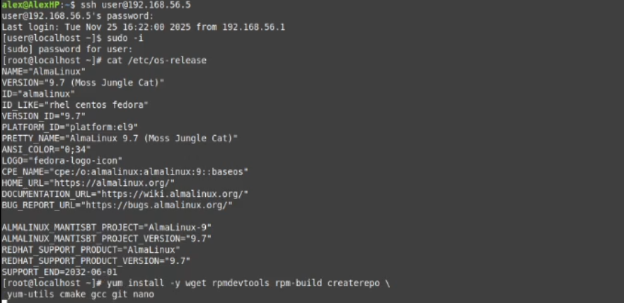

Создаем каталог и устанавливаем исходники SRPM
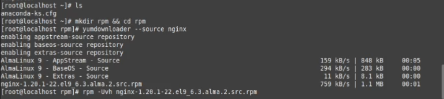

Устанавливаем зависимости для компиляции
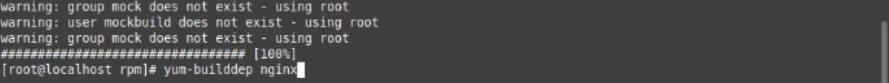

Качаем brotli, задаем параметры
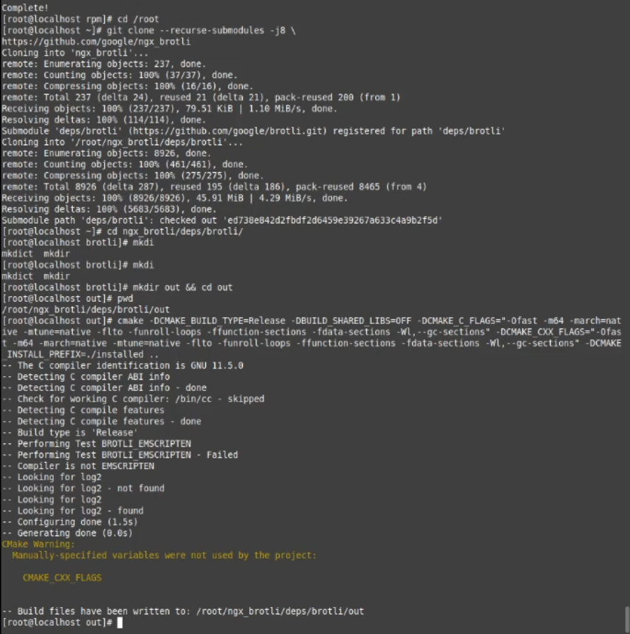

Собираем модуль
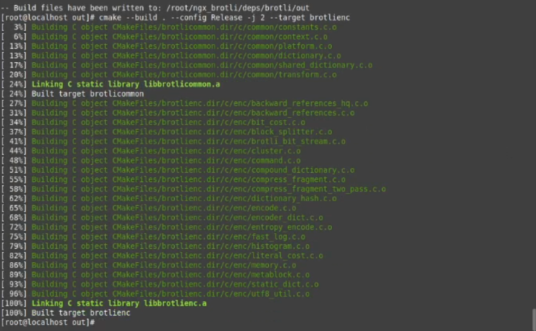

Идём в spec и добавляем в config наш модуль
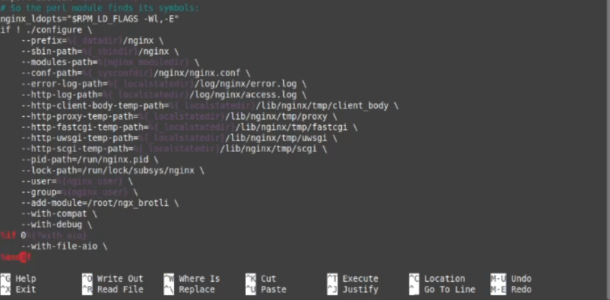

Приступаем к сборке nginx
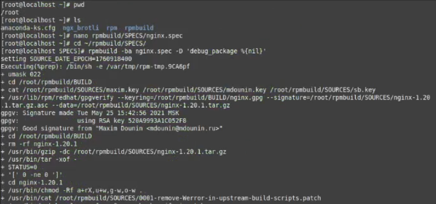

Иии.. получаем ошибку
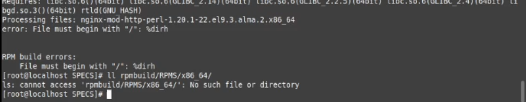

Молимся богам линукса и находим ошибку, нужно прописать %dir вместо %dirh. Почему эта ошибка существует история умалчивает.
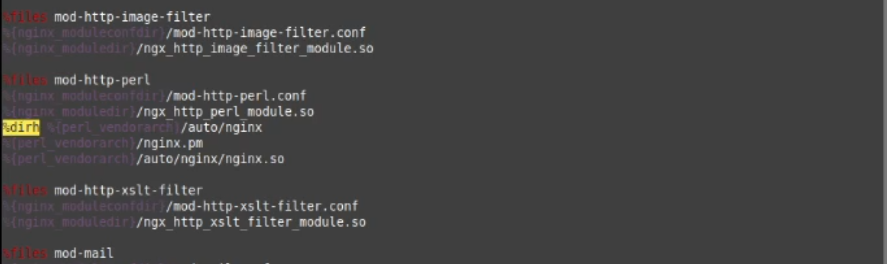

После очередной компиляции, скрестив пальцы, получаем результат без ошибок. Смотрим наши .rpm
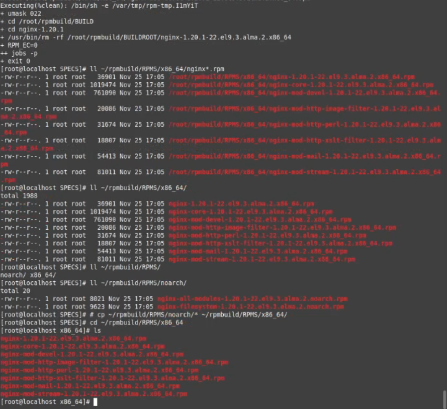

Копируем все .rpm в одну дирректорию ёи запукаем пакетную установку yum
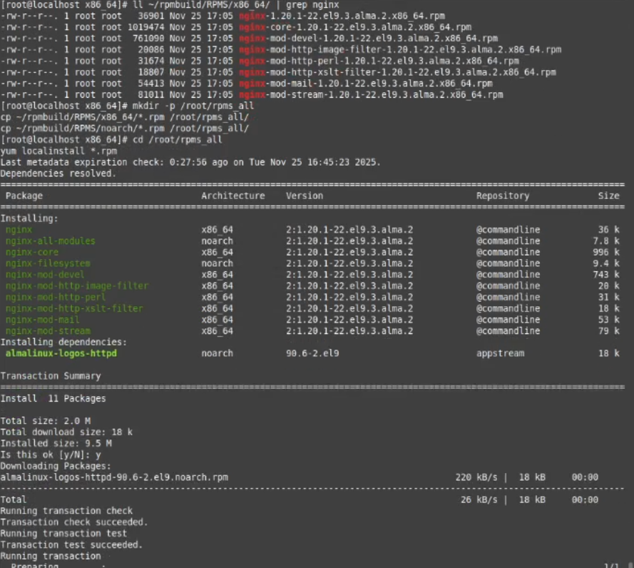

Всё прошло удачно и наш nginx работает
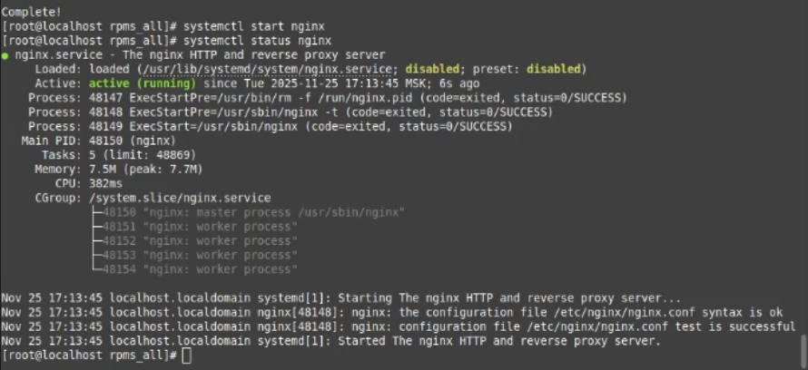

Даже наш модуль подгрузился. Можно создавать репозиторий.
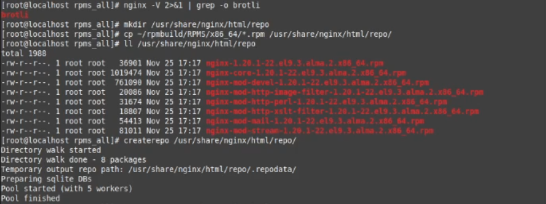

Идем в конфиг nginx и прописываем параметры для каталога.
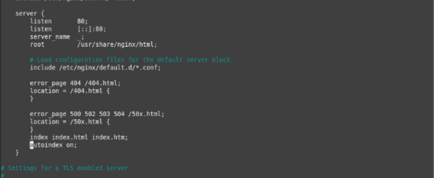

Проверяем синтаксис перезапускаем nginx и curlом проверяем что всё поднялось
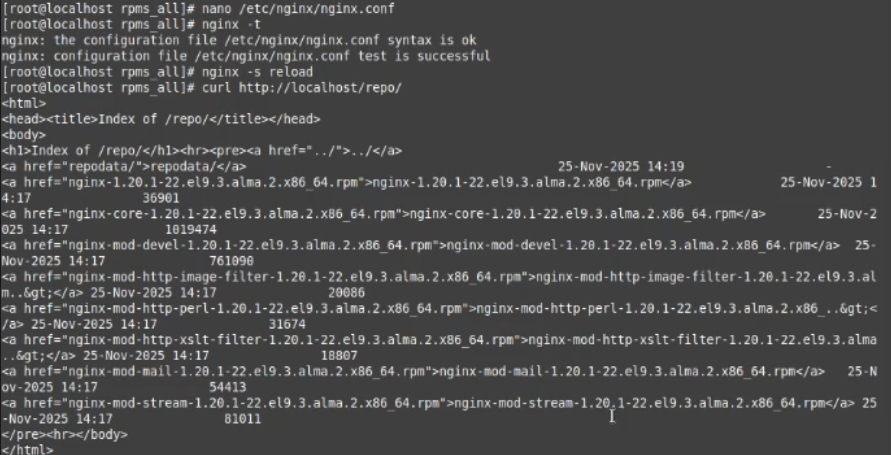

Указываем yum где находится наша чудо программа. Проверяем что он её видит. Качаем и добавляем туда percona.
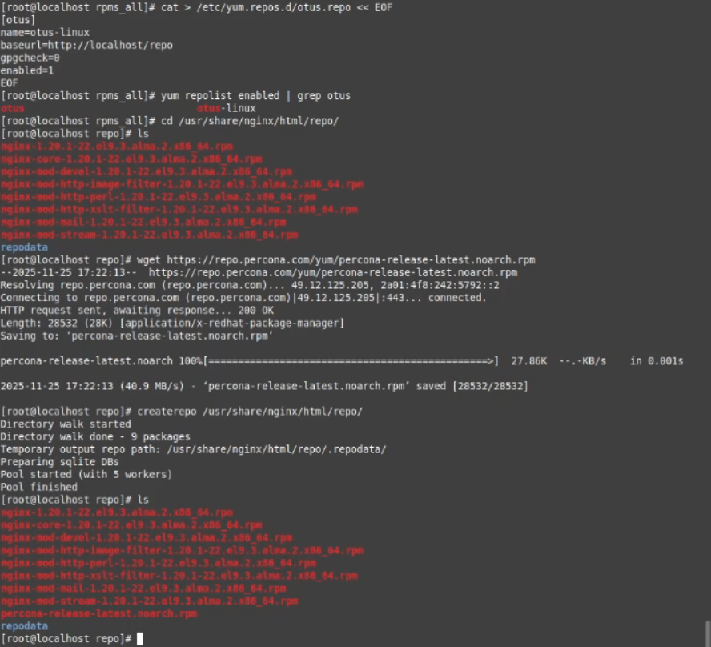

Теперь ставим percona из новенького репозитория
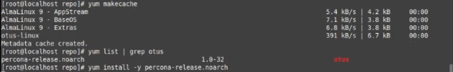

Видим что всё работает
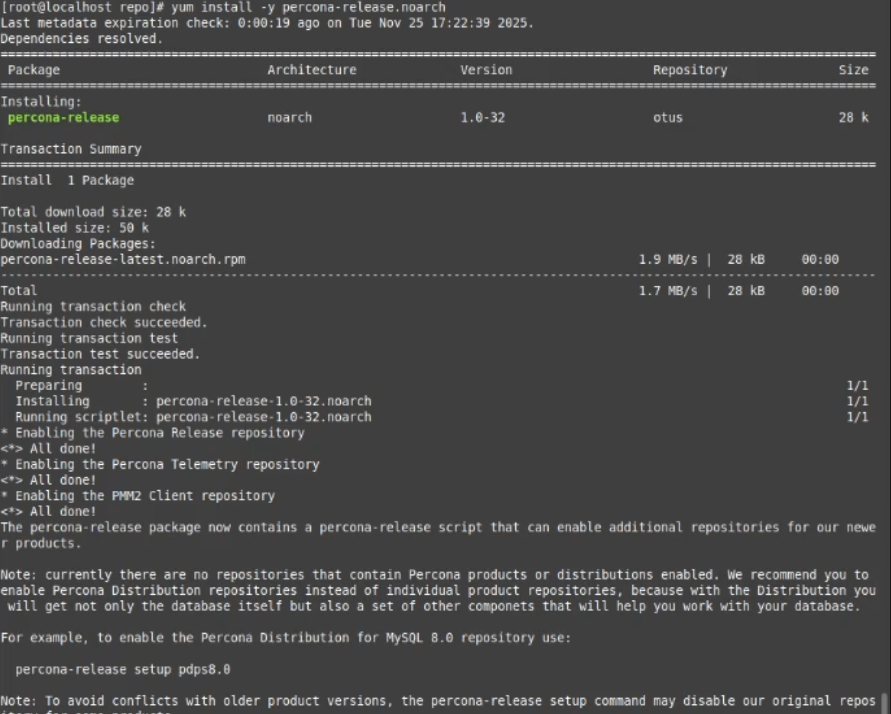

Еще раз проверяем curlом, видим что репозиторий поменялся. Мы прекрасны.
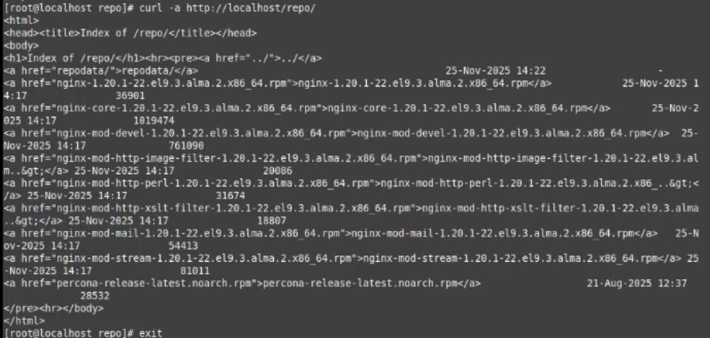
