# Домашняя работа - Загрузка системы

В качестве припарируемого буду использовать Ubuntu Srver 25.10.
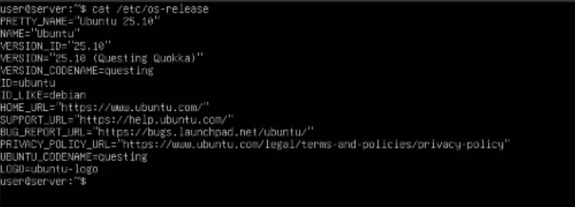

Первым делом редактирую /etc/default/grub, выстасляю таймаут 10 и коменчу строку скрытия, потом жму update-grub и перезагружаюсь.
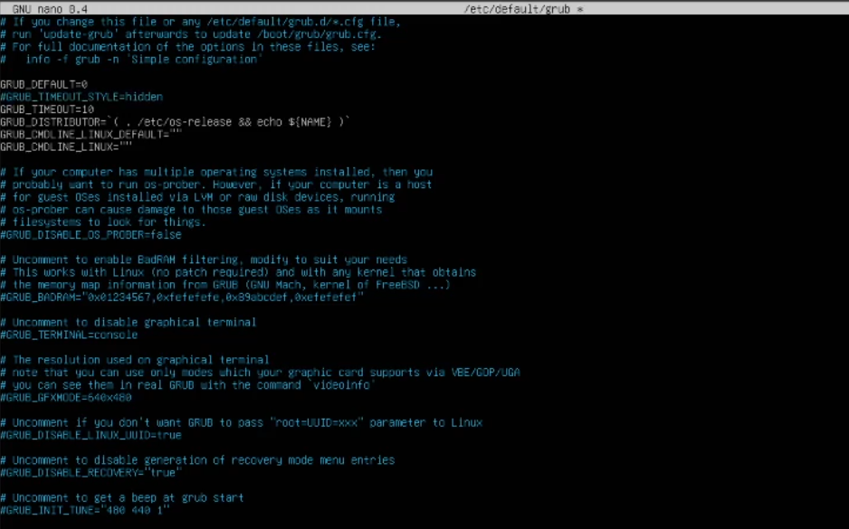

После перезагрузки появляется меню grub.
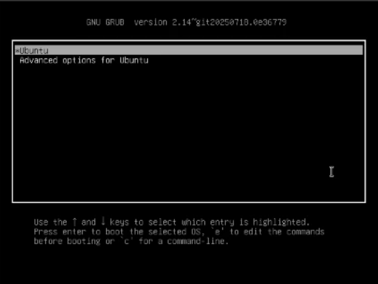

Прожимаю е и редактирую конфиг дописываюя к параметру linux атрибут init=/bin/bash, прожиамаю Ctrl+X.
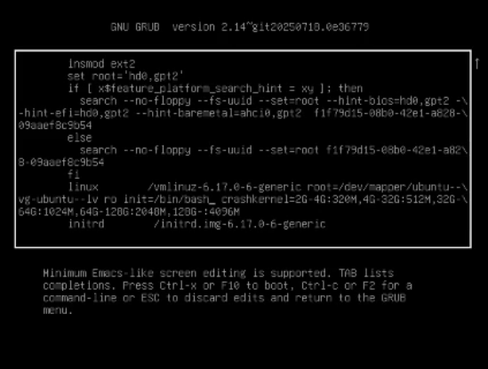

Загружаюсь в консоль под рутом и сразу монтирую корень в режим rw.
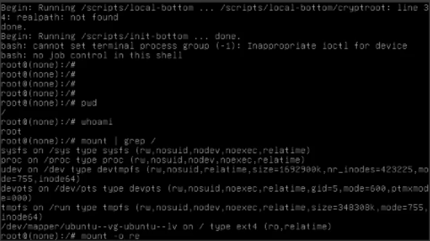

После успешного монтирования командой passwd меняю пароль пользователя. Успешно.
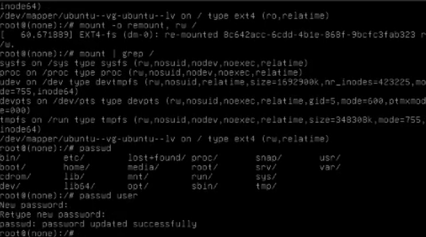

Второй путь для сброса - режим восстановления из Advanced options. Здесь сразу ждум network чтобы перемонтировать корень в rw
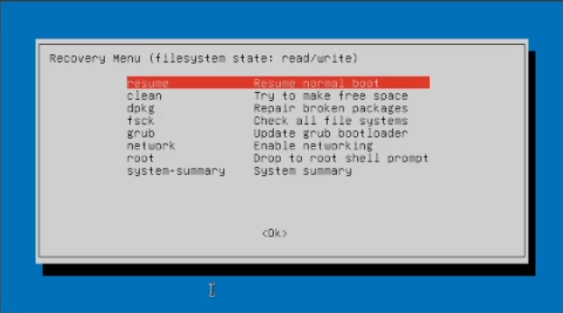

Далее выбираю root и той жде командой сбрасываю пароль.
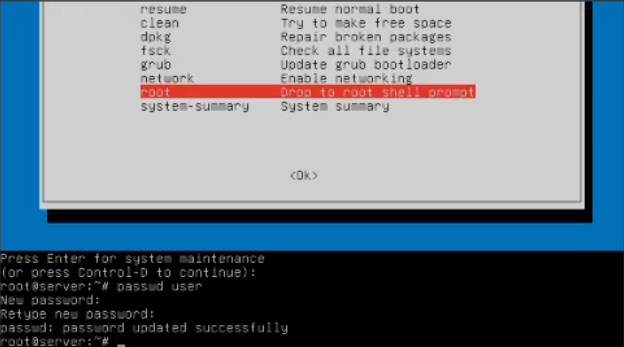

Теперь приступаю к переменованию VG, командой vgrename переименовываю группу в ubuntu-otus.
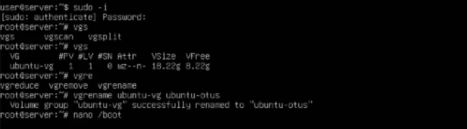

Далее иду в /boot/grub/grub.cfg, нахожу все упоминания старой ubuntu--vg и меняю их на ubuntu--otus.
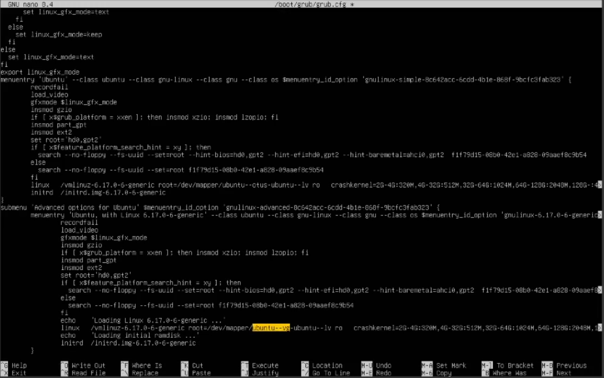

После перезагрузки любуюсь результатом, всё работает.
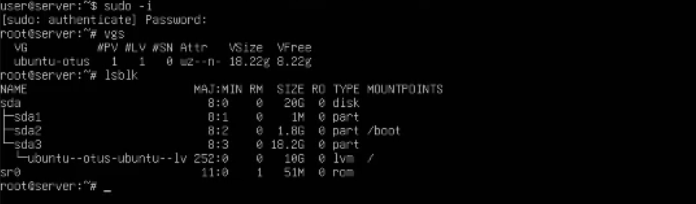

