# Домашняя работа по Systemd

## Задание 1: Написать service, который будет раз в 30 секунд мониторить лог на предмет наличия ключевого слова (файл лога и ключевое слово должны задаваться в /etc/default).

Создаю файл конфига с переменными, пишу скрипт для поиска ключекого слова, выдаю скрипту права на выполнение. 
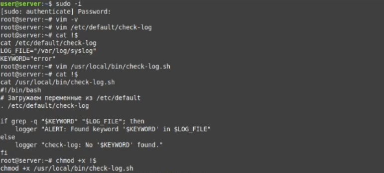

Пишу юнит-сервис, который разово запускает скрипт. Затем пишу таймер юнит-таймер для юнит-сервиса, запуск 1 раз в 30 сек.
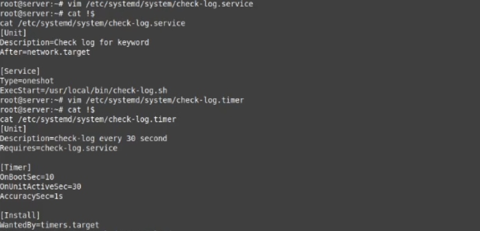

Запускаю пересчет конфигов systemd, запускаю выполнение таймера и иду мониторить журнал. В соседнем окне делаю запись в логах и вижу в журнале Alert.
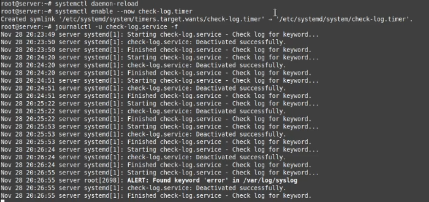

## Задание 2: Установить spawn-fcgi и создать unit-файл (spawn-fcgi.sevice) с помощью переделки init-скрипта (https://gist.github.com/cea2k/1318020).

Устанавливаю необходимый софт.
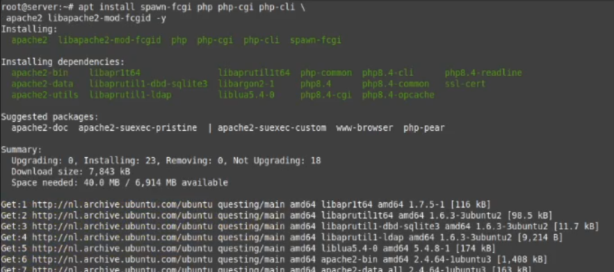

Прописываю конфиг spawn-fcgi с нужными опциями.
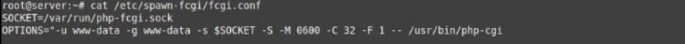

Прописываю юнит-сервис, не забываю указать $OPTIONS.
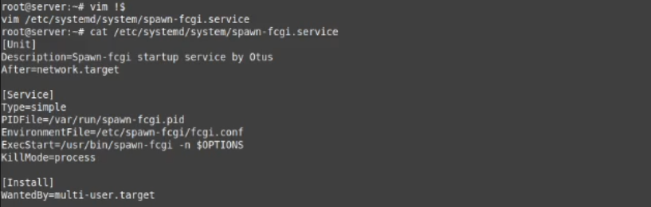

Запускаю сервис и проверяю работу.
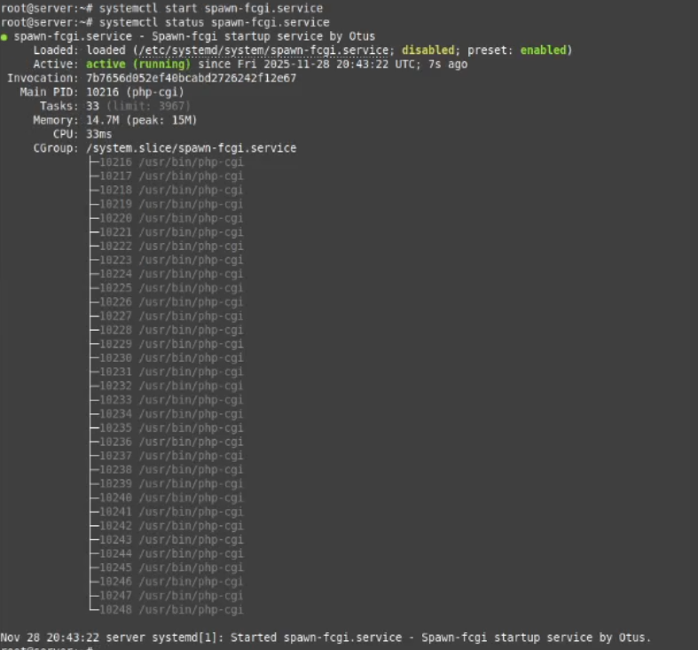

## Задание 3: Доработать unit-файл Nginx (nginx.service) для запуска нескольких инстансов сервера с разными конфигурационными файлами одновременно. 

Nginx у меня уже установлен. Чтобы все получилось отключу его через systemctl stop\disable.
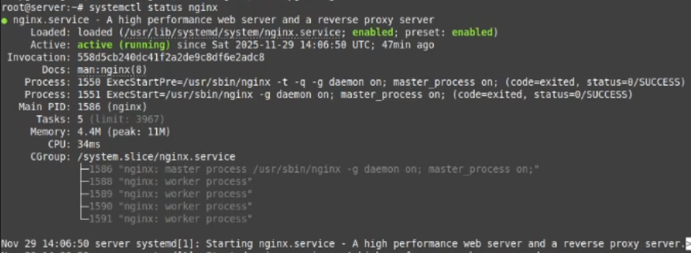

Создаю директорию для конфигов и прописываю два конфига с портами 8080 и 8081.
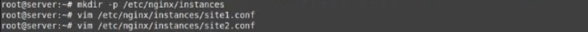

Конфиги имеют следующий вид.
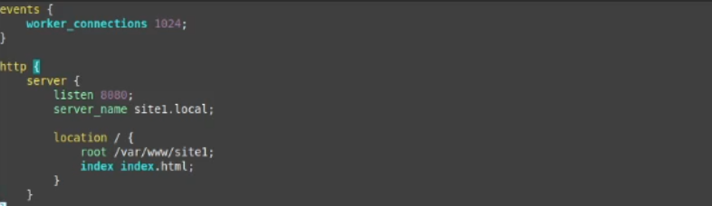

Создаю директорию для страниц, минимально заполняю их.
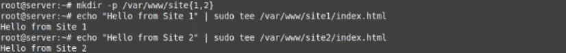

Копирую оригинальный юнит и создаю из него шиблон командой `cp /lib/systemd/system/nginx.service /etc/systemd/system/nginx@.service`. В ExecStart дописываю путь к нашим конфигам.
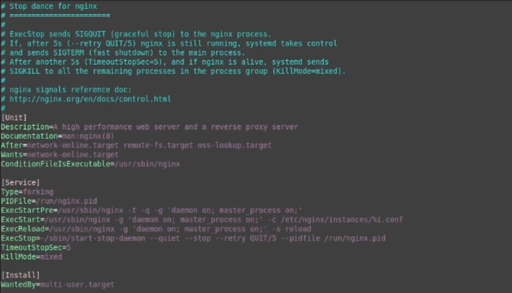

Проверяю синтаксис конфигов.
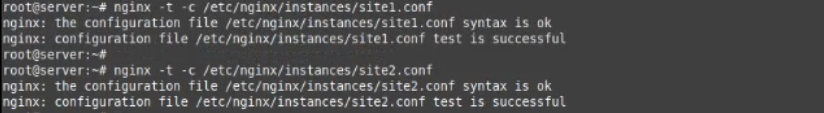

Запускаю пересчет systemd, стартую обе ноды и смотрю статус, всё поднялось.
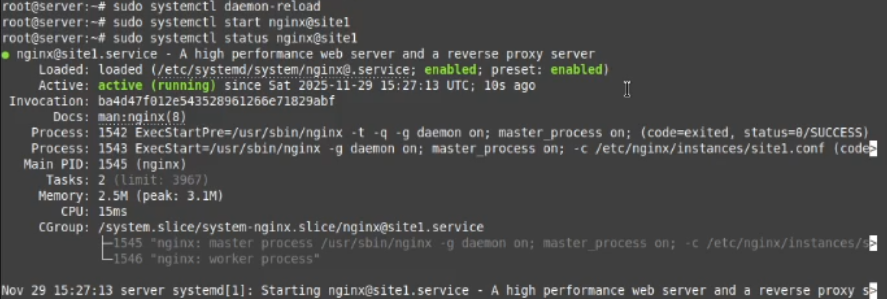

Проверяю порты и процессы, вижу два запущенных экземпляров nginx.
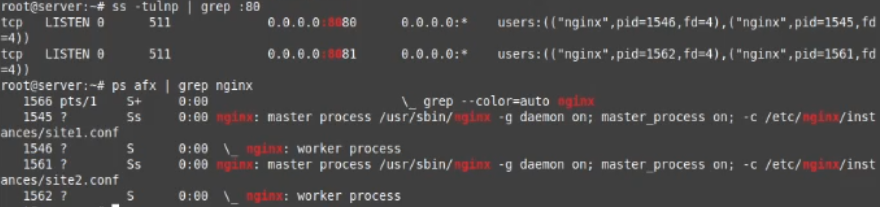

Проверяю curl-ом что сайты подняты.
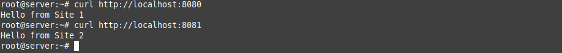
