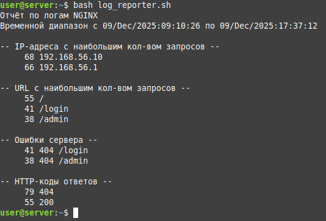
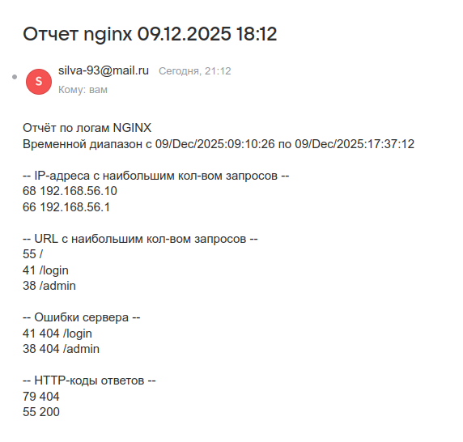
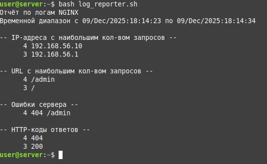
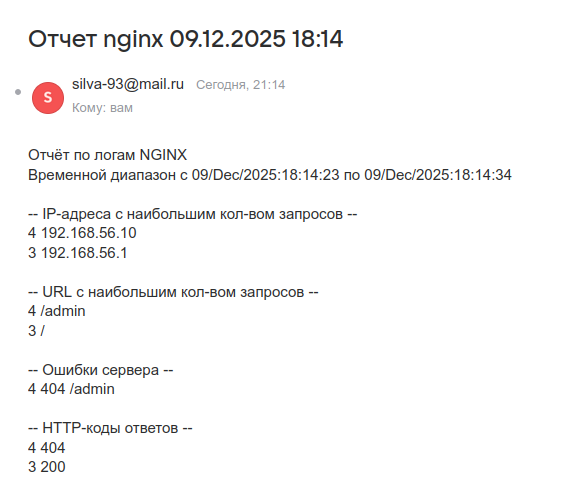
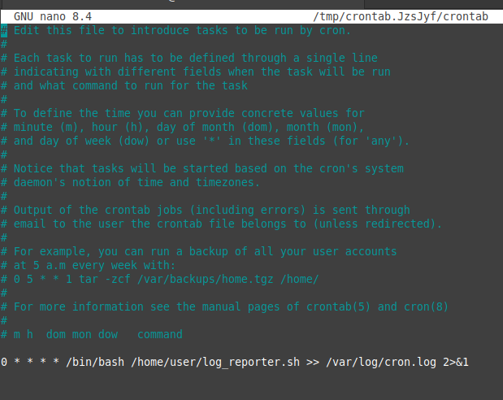

# Домашняя работа - Написать скрипт на bush

## Задание 
Написать скрипт для CRON, который раз в час формирует отчёт и отправляет его на заданную почту.

Отчёт должен содержать:
- IP-адреса с наибольшим числом запросов (с момента последнего запуска);
- Запрашиваемые URL с наибольшим числом запросов (с момента последнего запуска);
- Ошибки веб-сервера/приложения (с момента последнего запуска);
- HTTP-коды ответов с указанием их количества (с момента последнего запуска).

Скрипт должен предотвращать одновременный запуск нескольких копий, до его завершения.
В письме должен быть прописан обрабатываемый временной диапазон.

## Решение

Задание выполнял на Ubuntu Server, оговорюсь сразу что у меня уже настроен ssmtp для отправки писем.
Так же написал коротенький скрипт на питоне, который создает бурную деятельно обращаясь к страничкам nginx, тем самым генеруя нужные нам логи для примера. Его так же приложил к работе.
В bash скрипте постарался подробно закоментить что делает каждая конкретная функция.
Для того чтобы оформить работу наглядно, добавил строку вывода отчета в консоль после завершения парсинга.
И так, поехали:

Вызываю скрипт из консоли, это первый вызов, он парсит лги целиком.

По завершению получаю письмо на почту.

Пробую вызвать еще раз и получаю ответ, что пока новых логов нет.

Для наглядности запуска скрипт на питоне буквально на несколько секунд, его же запускаю на своем личном хосте.
После этого еще раз запускаю парсинг, вижу новые записи.

Тут же получаю второй отчет. Всё работает.

Осталось поместить это дело в cron с запуском раз в час.

