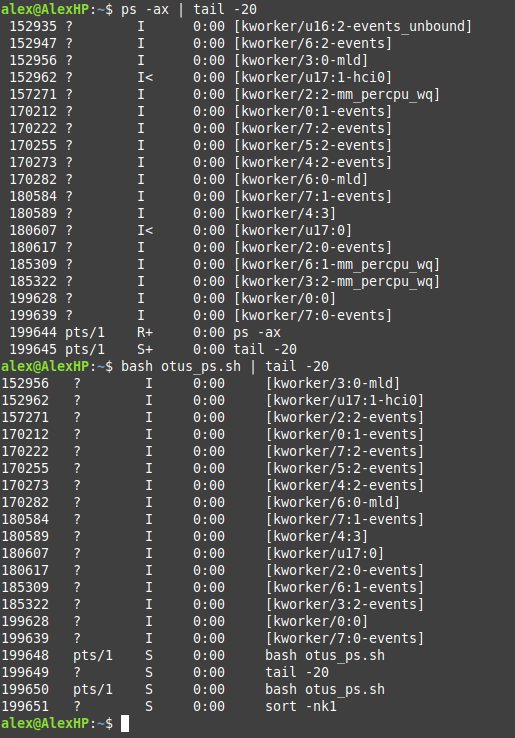

# Домашняя работа - Управление процессами

## Задание 

Из 5 заданий на выбор я выбрал: Написать свою реализацию ps ax используя анализ /proc

## Решение

Написанный скрипт отображает лишь часть функционала оригинального ps с аргументами ax

Здесь не учтена вся глубина и скорость работы оригинальной программы.

Тем не менее, скрипт парсит параметры процессов довольно наглядно.

Для сравнения на скриншоте представил 20 строк вывода скрипта и ps ax

