# Домашняя работа по SELinux

## Задание 1: Запустить nginx на нестандартном порту 3-мя разными способами.

Задание буду выполнять на предложенном стенде https://github.com/Nickmob/vagrant_selinux, зарянее разверну его через Vagrant 

Сразу после запуска осматриваюсь, вижу что nginx не поднялся. По логам запуска vagrant знаю, что для nginx присвоен 4881 порт. Проверяю что выключен фаерволл, проверю синтаксис конфига nginx, проверяю что selinux включен.

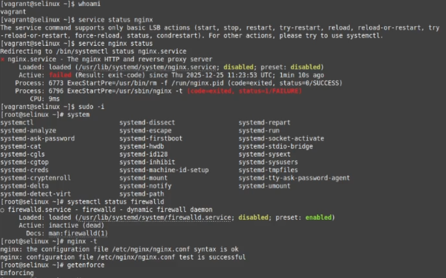

### Способ 1 - Переключатели setsebool.

Провожу аудит логов, вижу что аудит предлагает включить параметр nis_enabled. Включаю параметр, проверяю что включился, пробую перезапустить nginx. 

Сработало. Выключаю параметр обратно. 

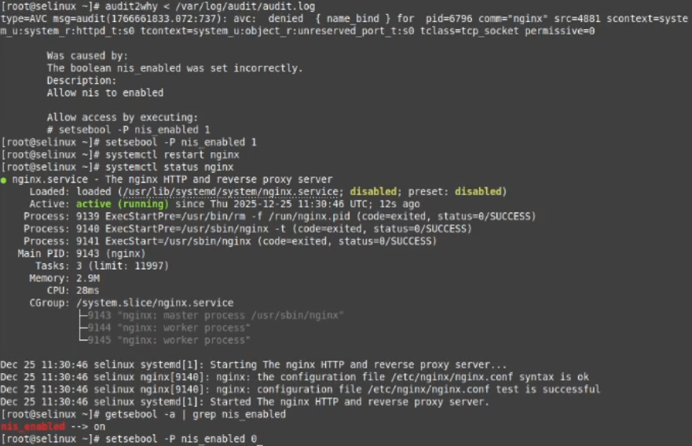

### Способ 2 - Добавление нестандартного порта в имеющийся тип.

Смотрю какие порты для http открыты в SELinux, вижу что 4881 отсутствует. Добавляю его, проверяю что добавился, чекаю nginx.

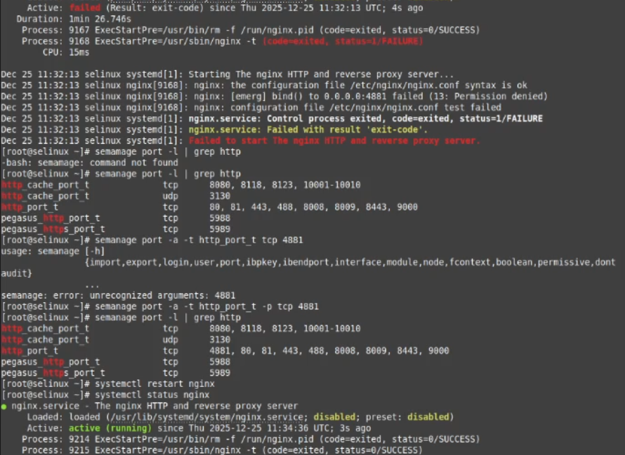

Сработало. Теперь удаляю порт и снова ничего не работает.

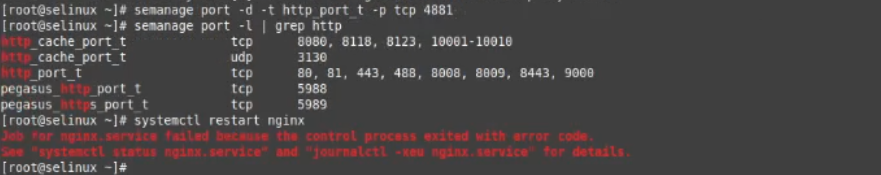

### Способ 3 - Формирование и установка модуля SELinux.

С помощью аудита логов делаю модуль и применяю его. Сработало.

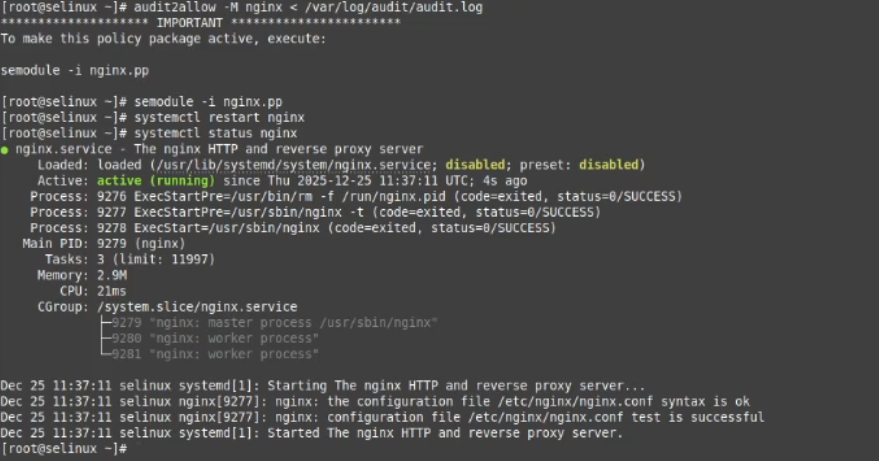

## Задание 2: 

###Развернуть тестовый стенд, выяснить причину неработоспособности механизма обновления зоны, предложить решение.

Копирую с гита стенд https://github.com/Nickmob/vagrant_selinux_dns_problems.git, разворачиваю 2 ВМ (клиент и сервер), проверяю что они запустились и захожу на них.

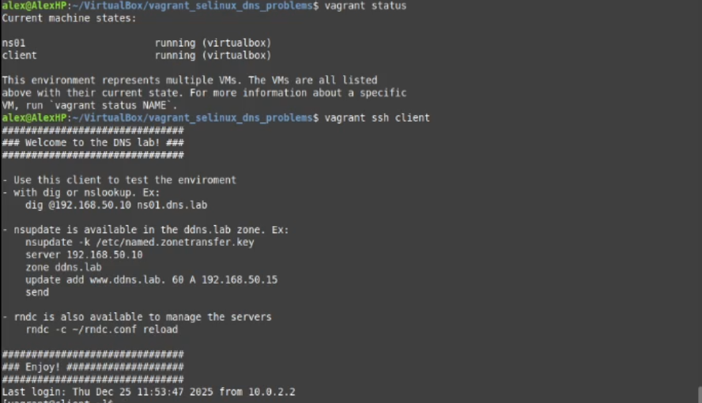

Попробую внести изменения в зону, но получаю ошибку.

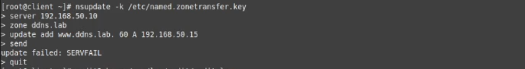

Иду на сервер, запускаю аудит логов. Аудит подсказывает, что проблема в контексте безопасности. 

Проверяю конфиги /etc/named и сравниваю с зоной localhost. Вижу что в конфигах проставлен контекст named_conf_t вместо нужного named_zone_t. 

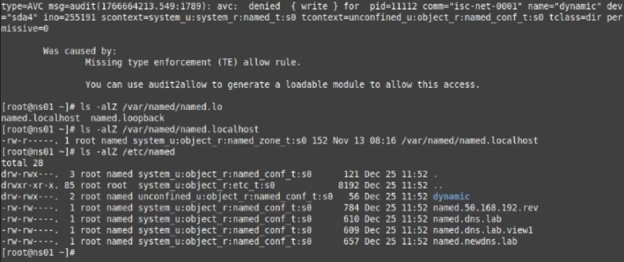

Такой контекст конфиги получили из-за того, что лежат в другой дирректории, на которую распространяется иной контекст.

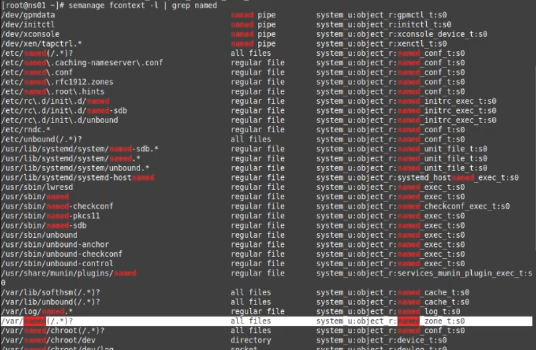

Простым способом решения проблемы будет изменение контекста конфигов на правильный, так и сделаю.

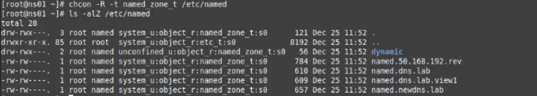

После изменения возвращаюсь на клиент и снова пробую внести изминения. 

Запрос успешно отправлен, проверяю работу, всё отлично.

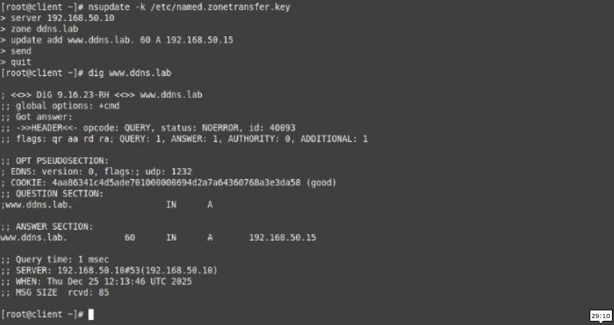

Перезагружаю машины и проверяю ещё раз. Работает.

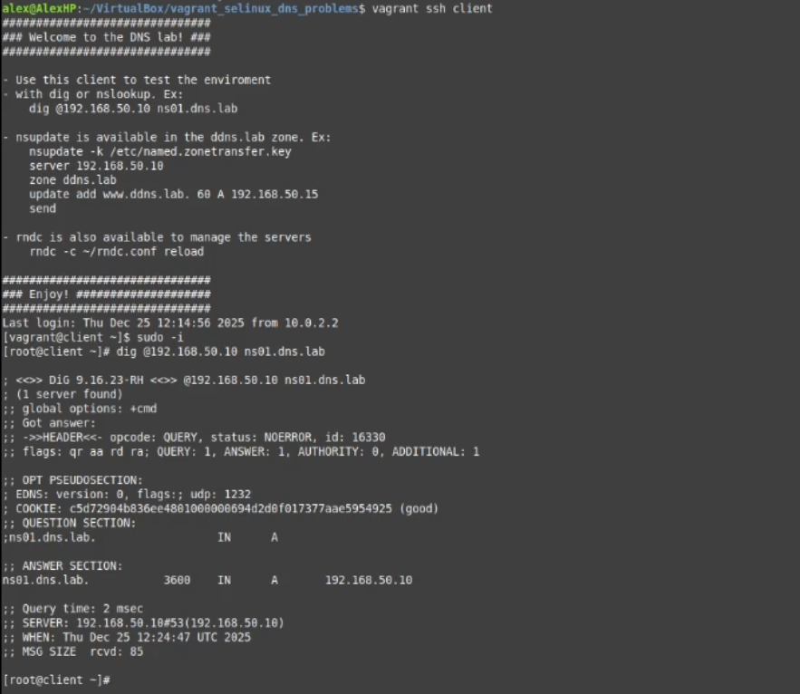

