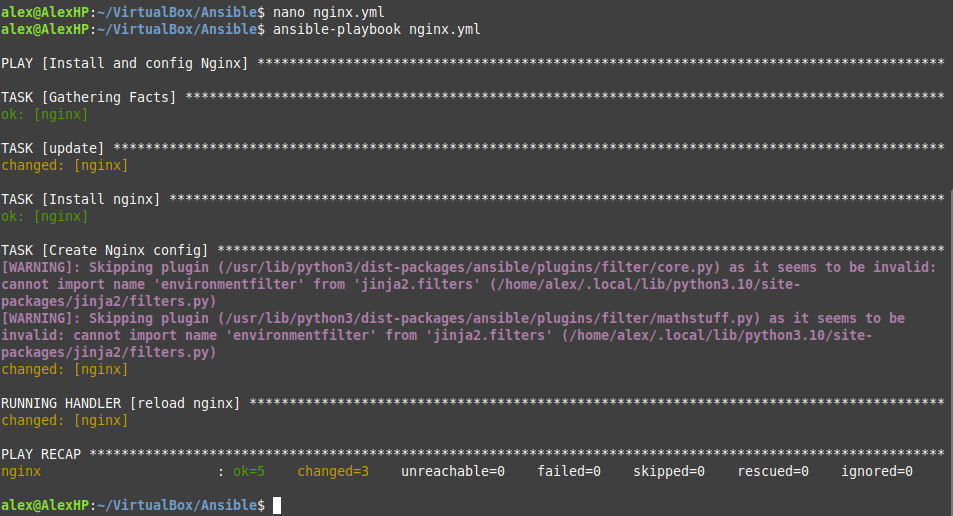
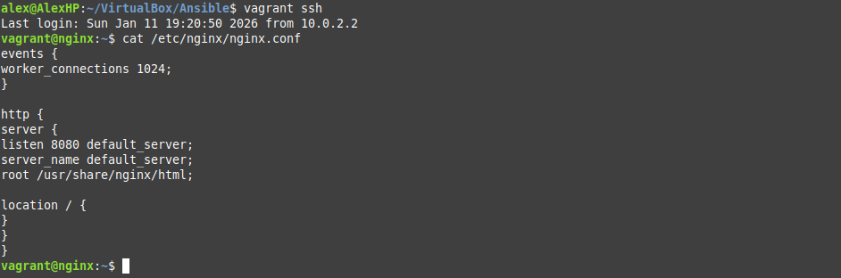
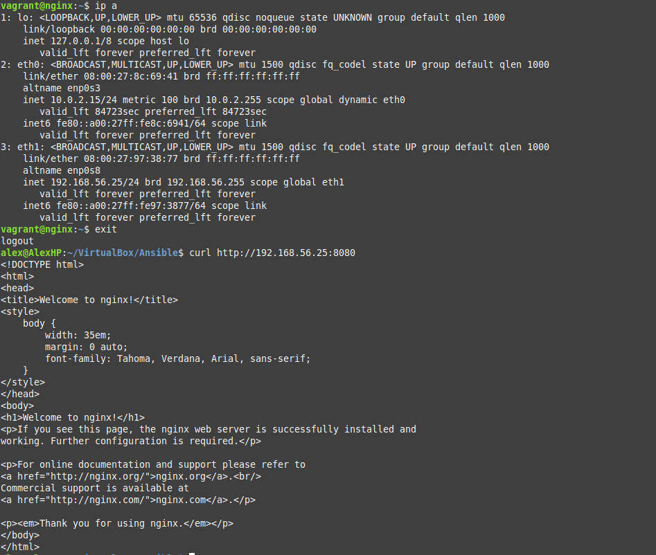

# Домашняя работа по Ansible

Подготовку машины в Vagrant файле оставлю за кадром, все написанные конфиги можно увидеть в папке Files.

После запуска ВМ проверяю что ansible может достучаться до хоста.

Запускаю плейбук, который установит nginx, прокинет обновленный конфиг и перезапустит его.

При выполнении плейбука увидел предупреждения, зайду на хост и проверю скопировался ли конфиг. Вижу что всё ок.

Курлом проверяю поднялся ли nginx на хосте после всех манипуляций. Всё сработало как надо. 

