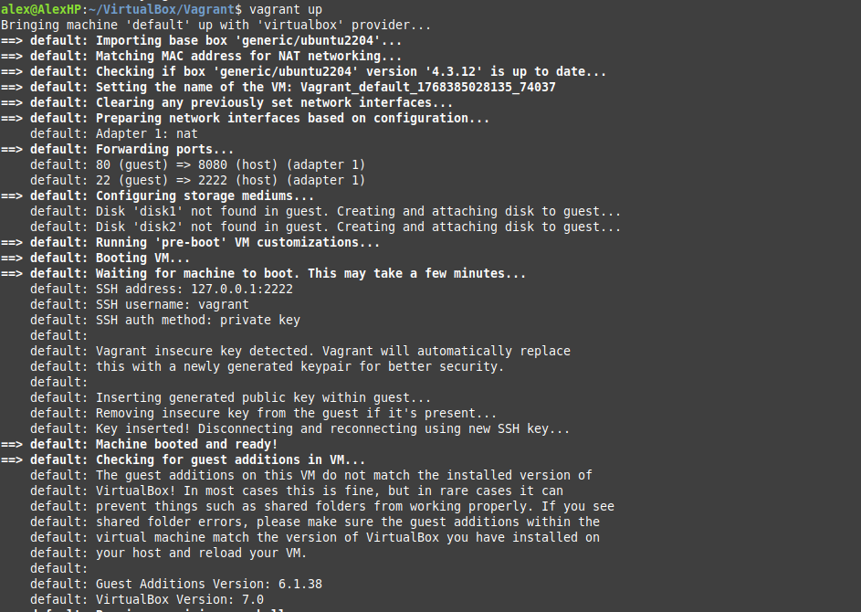
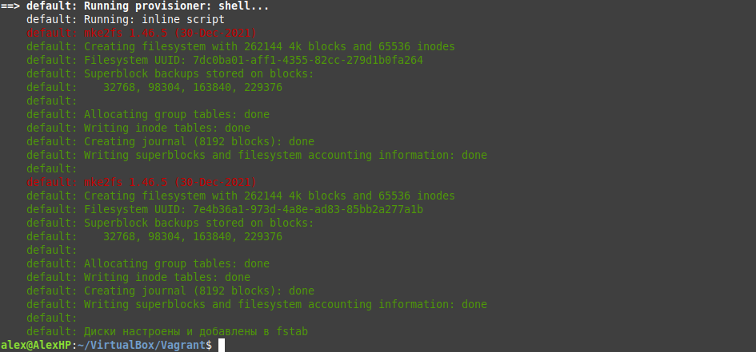
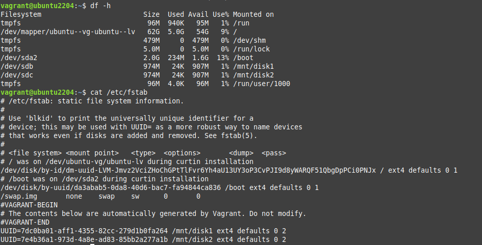
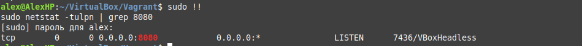

# Домашняя работа по Vagrant

Готовый Vagrantfile приложен, в нем добавил комментирии с описанием. 
Запускаю, машина корректно создается, нужные настройки присутствуют.

Далее выполняется провижинг с созданием, форматированием и монтированием дисков.

Захожду на машину и проверю что диски корректно создались и смонтировались.

На основной машине проверяю что порт слушается.

