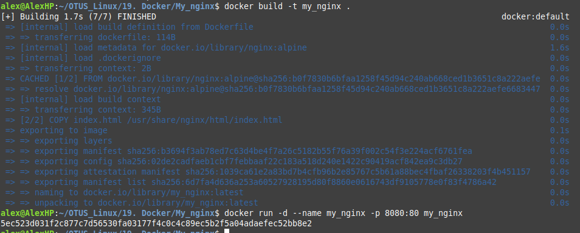

# Домашняя работа по Docker

Docker и compose у меня уже установлены.
Docker version 29.1.4, build 0e6fee6

Пишу простой index.html чтобы передать его в контейнер, файл во вложениях.

Собираю образ и запускаю контейнер.

Просверяю через curl что страница запустилась.

### Разница между образом и контейнером 

Docker-образ — это шаблон , который содержит ФС, зависимости, код и метаданные, необходимые для запуска приложения. 

Docker-контейнер — это запущенный экземпляр образа. 

### Можно ли в контейнере собрать ядро?

Скомпилировать получится, приусловии что будуту необходимые для этого инструменты, но запустить не получится, т.к. контейнер использует ядро хостовой машины + контейнер не управляет загрузкой ОС.
