# Домашняя работа - Prometheus

Мониторинг буду делать на стеке Prometheus - Grafana, т.к. Zabbix пока не проходили.
Работы провожу на виртуальном хосте с Ubuntu.

Сперва устанавливаю Node Exporter с помощью которого и будут собираться системный метрики работающего железа.
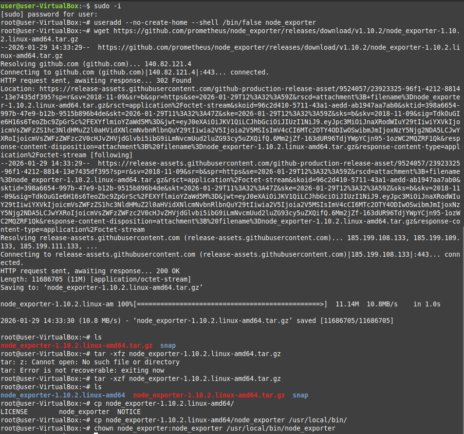

После распаковки архива распихиваю файлы по нужным местам и пишу Unit для автозапуска.
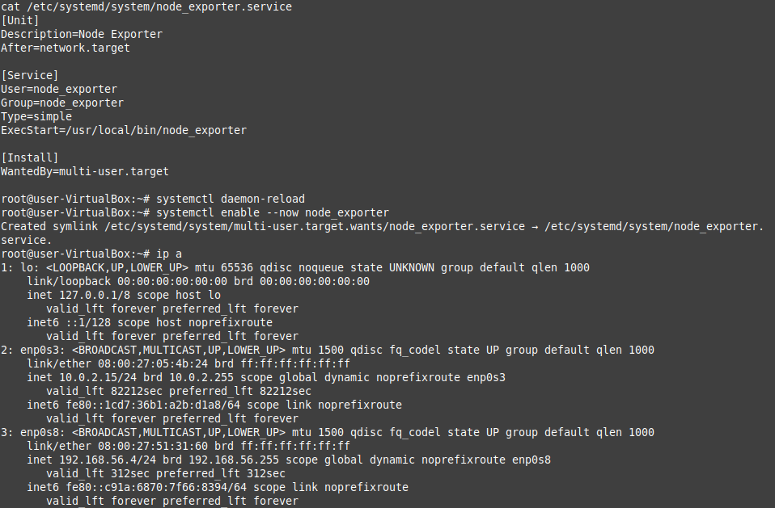

Проверяю что сервис заработал.
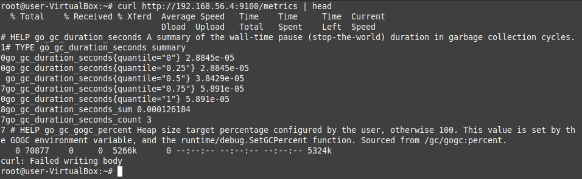

Далее перехожу к Prometheus, так же создаю юзера, качаю и открываю архив.
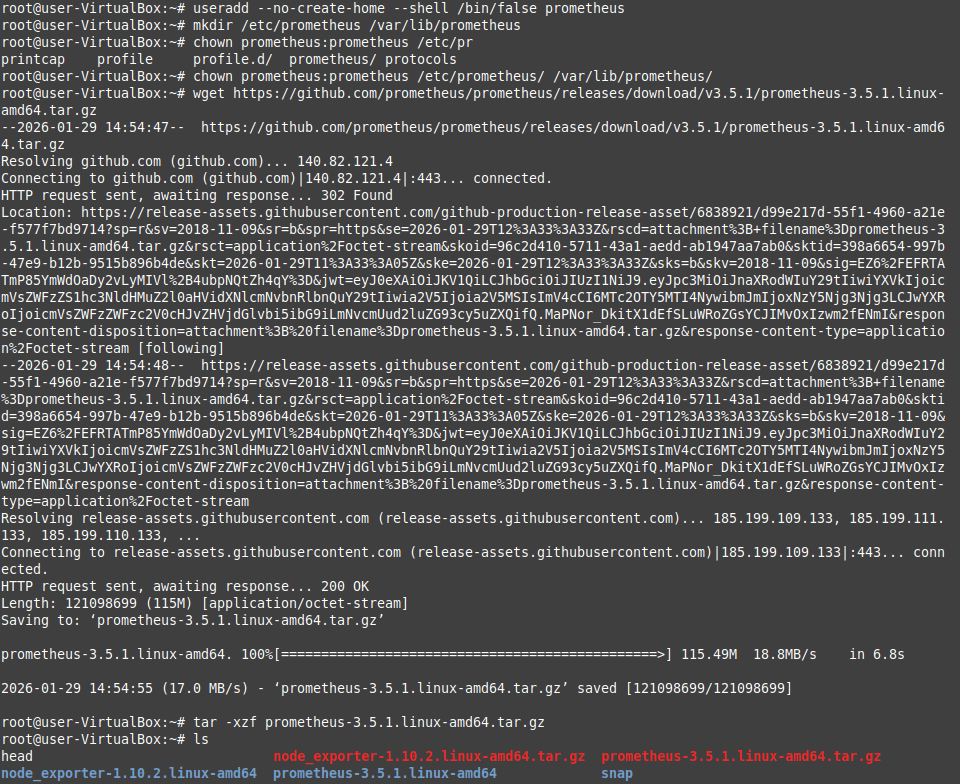

Раскидываю всё в нужные места.
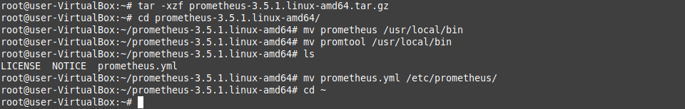

Слегка дорабатываю конфиг. Уже в графане понял что 15сек обновление многовато, позже скинул до 5.
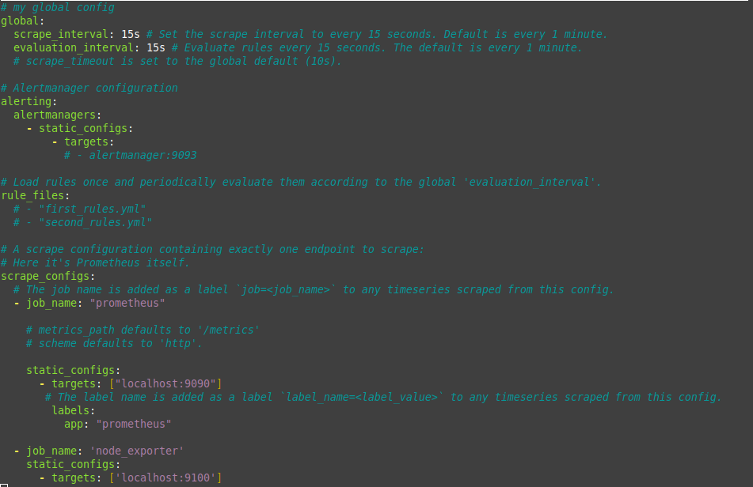

Проверяю что сервис работает.
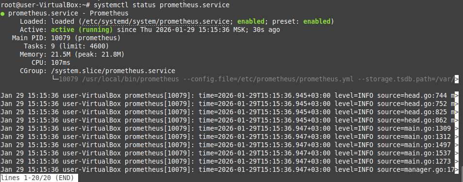

Смотрю так же со стороны веба.
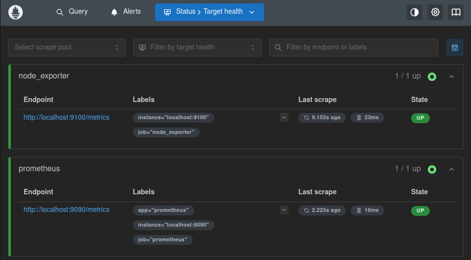

Далее были танцы с бубном по установке Grafana через VPN, оставил их за кадром, но результат успешный.
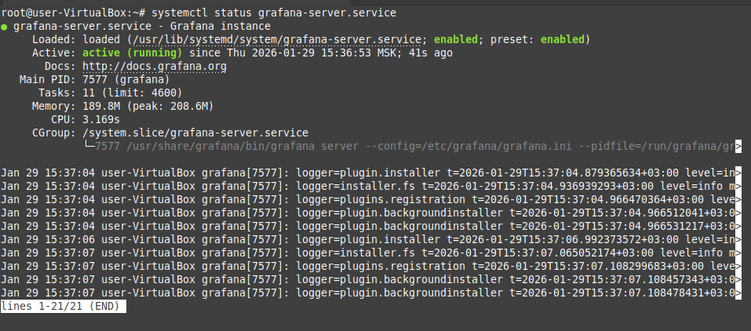

Иду в веб-интерфейс и логинюсь стандартным паролем.
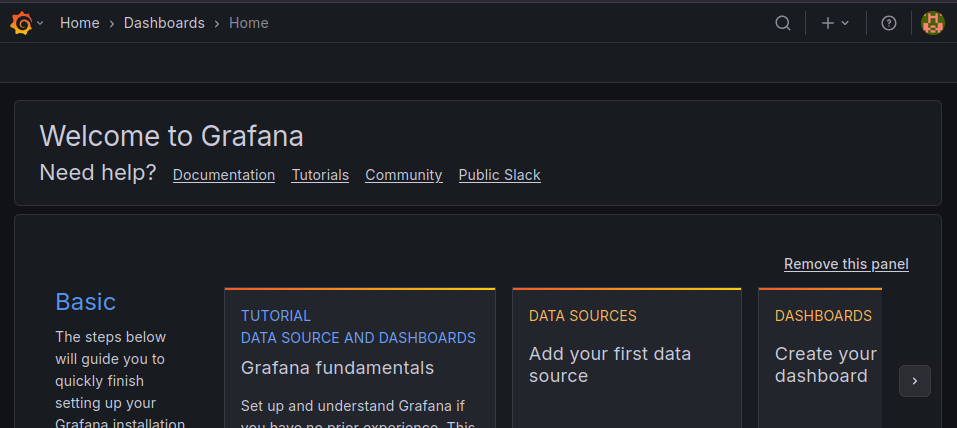

Создаю новый источник данных ссылаясь на порт, на котором крутится prometheus.
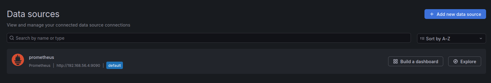

Последним шагом создаю дашборд. По рекомендации преподавателя взял готовый и подключил к нему мой источник.
Всё заработало, для пущей убедительности запустил на хосте стресс-тест, видно что мониторинг работает.
По успловиям задания переименовал дашик своим имененм.
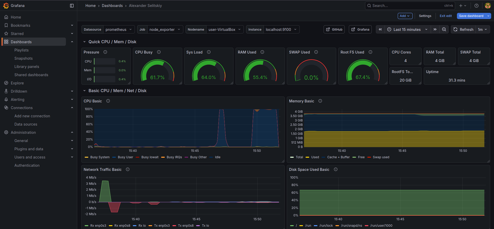

