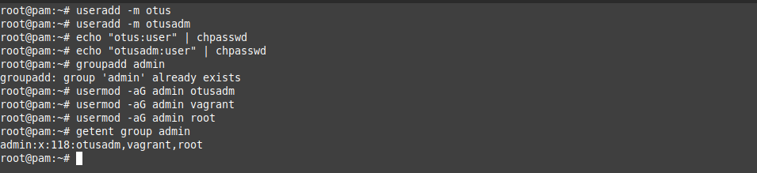
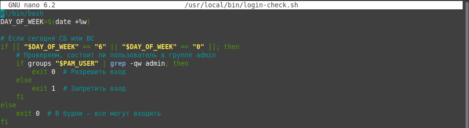
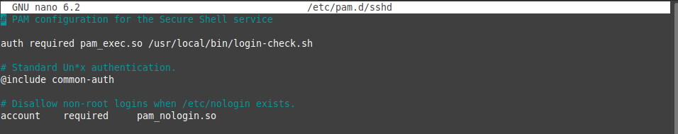
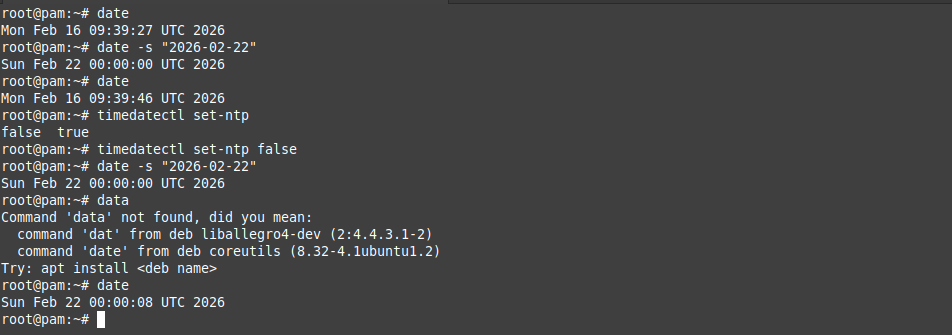
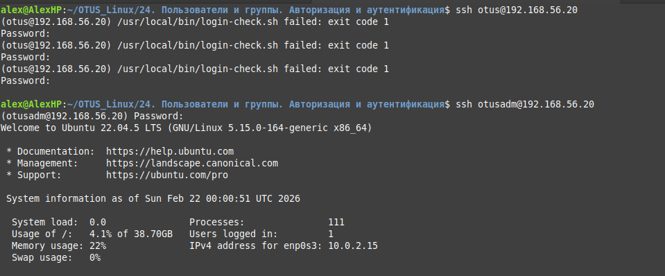

# Домашняя работа -  Пользователи и группы. Авторизация и аутентификация_РАМ

### Задание

Ограничить доступ к системе для всех пользователей, кроме группы администраторов, в выходные дни (суббота и воскресенье), за исключением праздничных дней.

### Решение

Для начала создам двух пользователей, задам им пароли и добавлю админа в группу админов.

Пишу скрипт для валидации выходного дня, в выходные только админы должны иметь доступ.

В конфиг pam прописываю правило со скриптом для проверки.

Сегодня понедельник и проверить скрипт не получится, поэтому меняю дату на субботу и отключаю синхронизацию с ntp сервером.

На своём хосте пытаюсь войти подл обоими пользователями. Видим что пользователь не состоящий в группе admin войти не может. Получается что всё работает корректно.

