# Домашняя работа - Основы сбора и хранения логов
 
Создаю две машины, сервер для сбора логов "log" и клиента "web".
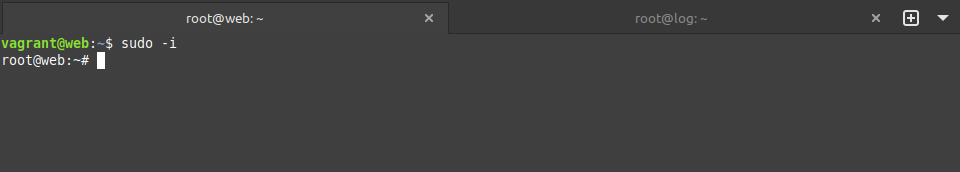

На сервере log в конфиге rsyslog включаю прослушку портов.
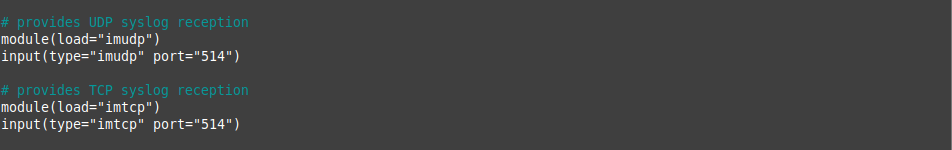

Здесь же описываю шаблон для сохранения логов.
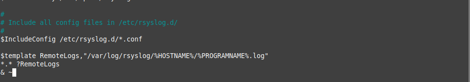

Проверяю что порты слушаются, передавать логи в итоге буде по TCP.
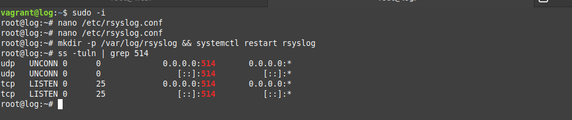

На клиенте ставлю nginx и проверяю что он запустился.
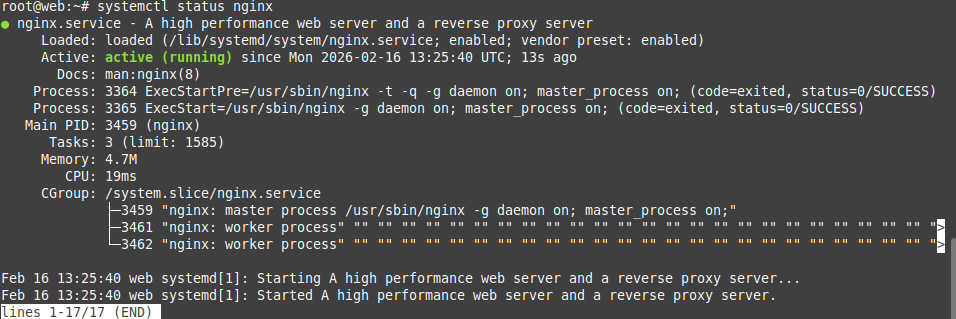

В конфигах nginx прописываю правила сохранения и разделения логов.
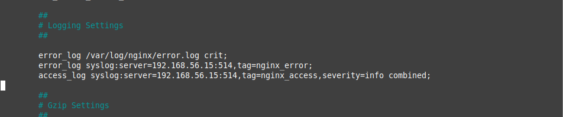

В демоне rsyslog указыфваю правила для перессылки всех логов на сервер.
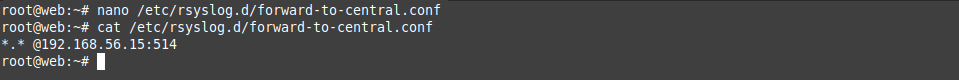

Проверяю синтаксис, перезапускаю все службы и делаю тестовый запрос.
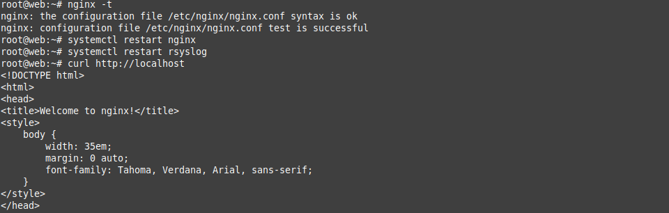

Со стороны сервера вижу что логи приходят.
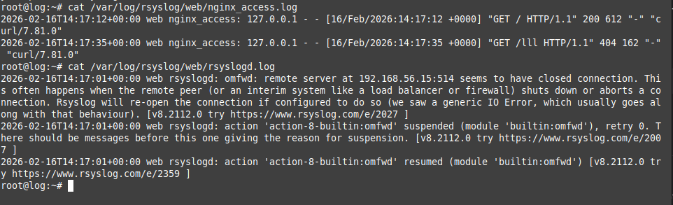

Теперь настроиваю логирование аудита, буду отслеживать изменения конфига nginx. Прописываю правило и перезапускаю аудит.
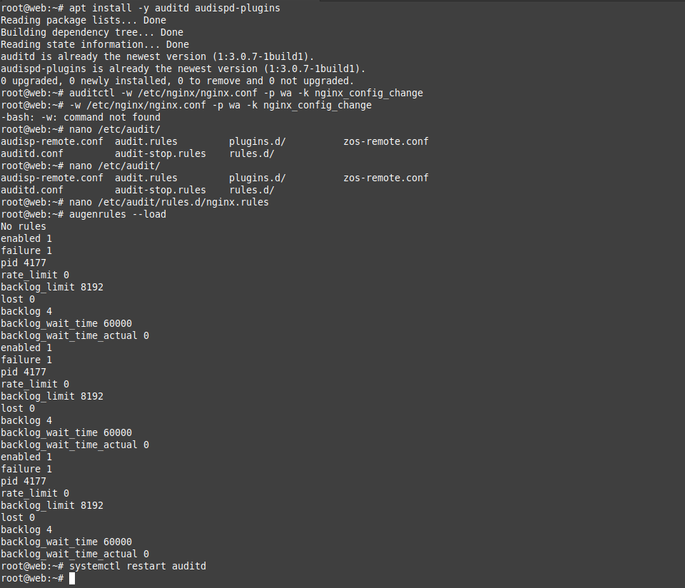

Включаю плагин перессылки в syslog.
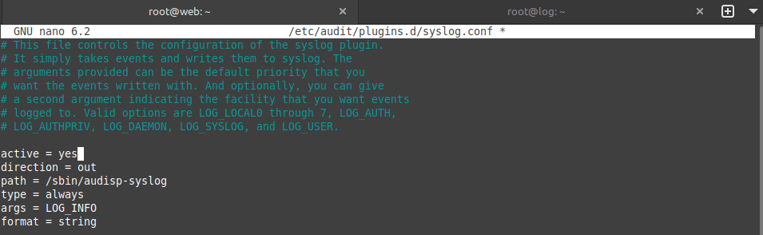

После выполняю на клиенте изменение nginx конфига и проверяю на сервере что логи аудита дошли. Всё работает.
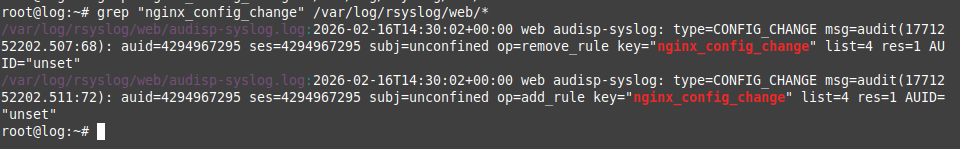

