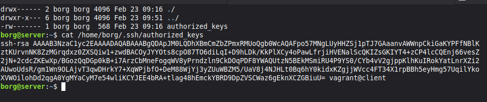
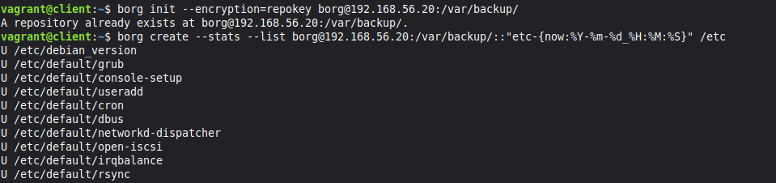
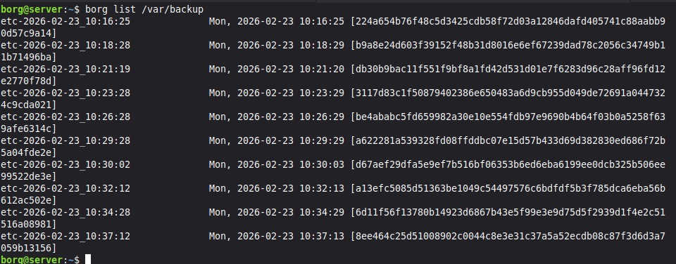
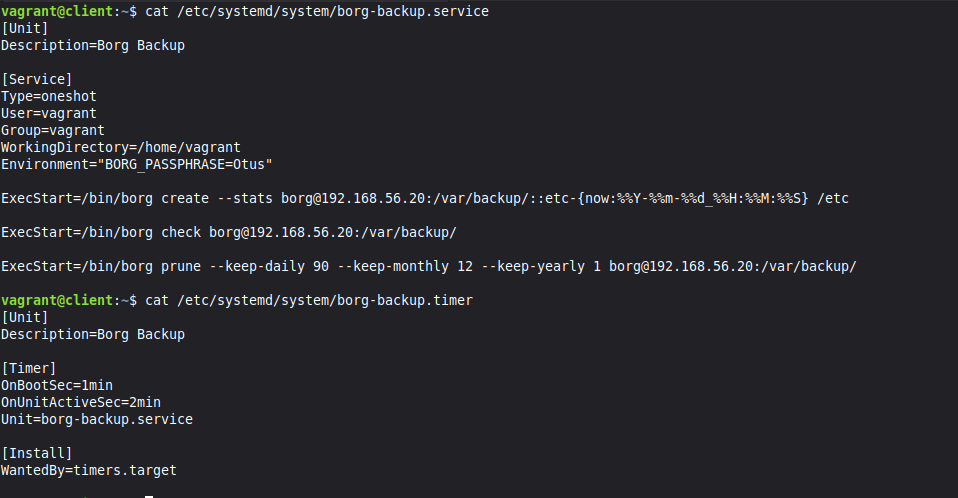
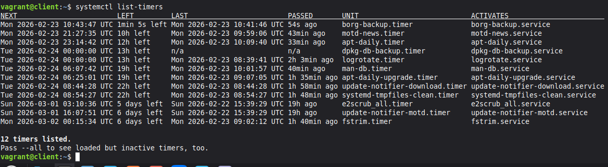
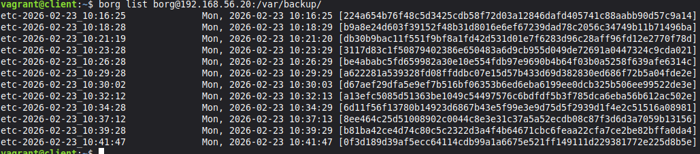
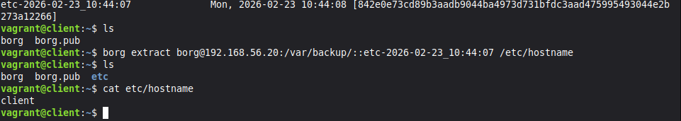

# Домашняя работа - Резервное копирование

Для начала пишу Vagrantfile, в котором поднимаю две машины: client и server (к нему создаю доп диск для бекапа).

Так же пишу небольшой плебук, с помощью которого буду:
- Обновлять список пакетов и устанавливать borg.
- Форматировать и монтировать диск для бекав в дирректорию /var/backup на сервере.
- Создавать пользователя borg и файл для ssh ключей на сервере.

Все файлы доступны к просмотру в директории Conf.

Первый делом подготовлю ssh ключи, чтобы клиент и сервер могли общаться. Для этого в файл /home/borg/.ssh/authorized_keys кладу сгенерированый ключь с клиента.

Теперь мождно инициализировать репозиторий и сделать первый бекап. При инициализации задаем пароль для шифрования. Позже объявляю его через export BORG_PASSPHRASE= чтобы не вводить каждый раз.

Идем на вервер и через borg list /var/backup смотрим появился ли бекап. Этот же список можно получить прямо с клиента обратившись к серверуv borg list borg@192.168.56.20:/var/backup/

Теперь создадим сервис для регулярного бекапа и таймер для его запуска. Здесь же указываю команду для удаления старыхз логов.

Видим что сервис и таймер отрабатывают.

Пока писал уже скопилось много бекапов.

Для примера представлю что случайно удалил файл hostname, попробую достать его из последнего бекапа.

