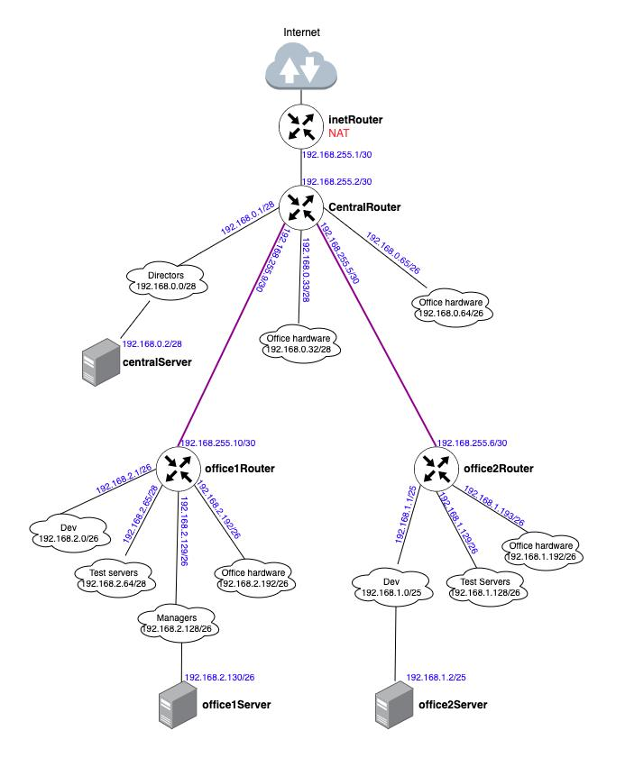
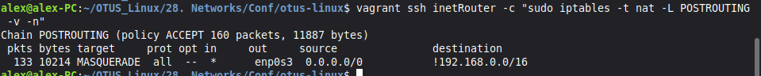
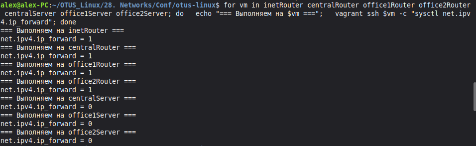
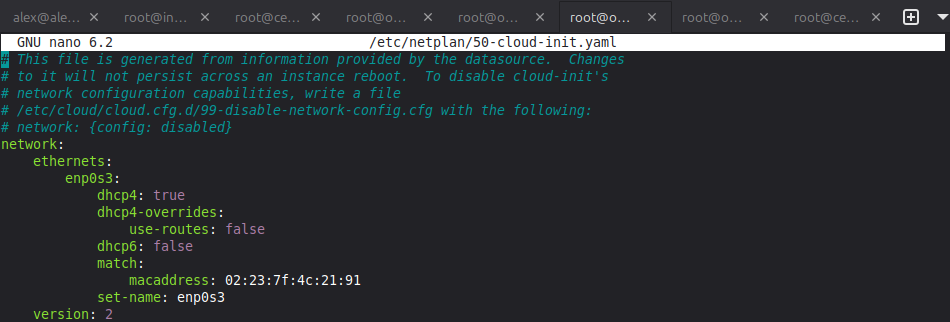
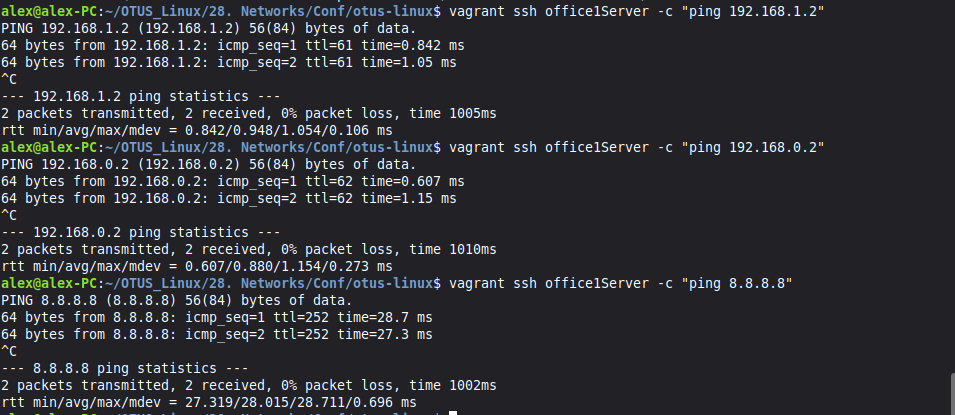
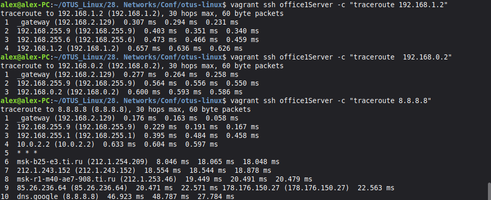

# Домашняя работа - Архитектуара сетей

Нужно развернуть сеть как на картинке

Написаный [Vagrantfile](./Conf/otus-linux/Vagrantfile) создает все необходимые мышины и размечает их интерфейсы под сети. Далее необходимо настроить маршрутизацию.

Начинаю с настройки NAT на inetRouter.

Далее включаю на всех роутерах форвардинг, после сохранения настроек и перезагрузки проверяю параметр на каждом хосте.

Также необходимо отключить маршрут по умолчанию везде кроме inetRouter. На каждой машине редактирую /etc/netplan/50-cloud-init.yaml 

Далее начинаю на каждом хосте в конфигах /etc/netplan/50-vagrant.yaml прописывать статические маршруты. 
Их получилось довольно много, результат можно посотреть в файле [routes](./Conf/otus-linux/routes).

После того как маршруты прописаны наша сеть готова. 
В качестве проверки пропинговал основные сервера office1Server и office2Server со всех хостов. 
Результаты пинга отображены в файлах: [ping_192.168.1.2](./Conf/otus-linux/ping_192.168.1.2) и [ping_192.168.2.130](./Conf/otus-linux/ping_192.168.2.130).

Для дополнительной демонстрации сделал пинги с office1Server до остальных серверов и интернета. 

И конечно же трассировку с office1Server до остальных серверов и интернета.

