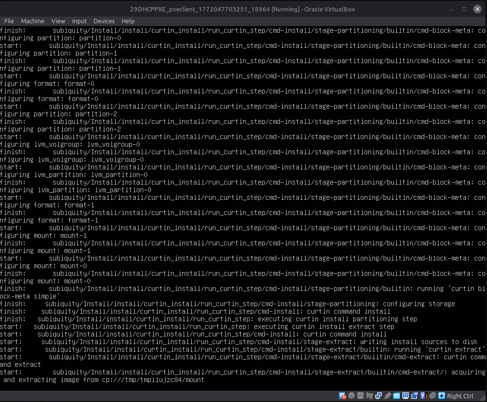
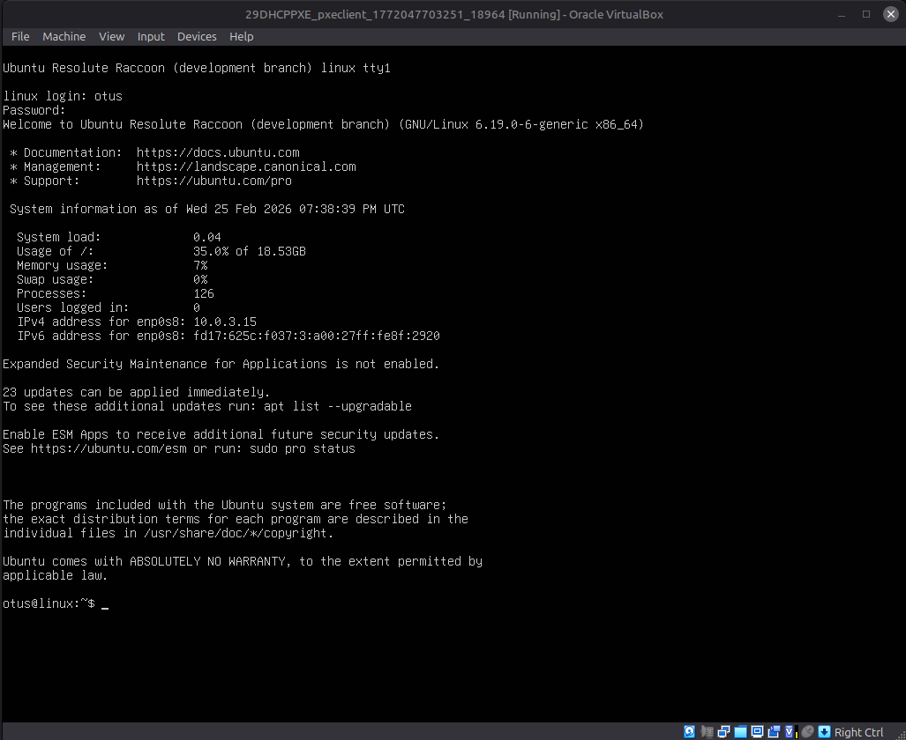
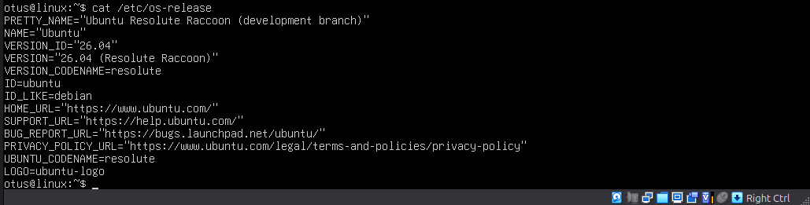

# Домашняя работа - DHCP и PXE

В [Vagrantfile](./Vagrantfile) написан конфиг, который разворачивает две машины - сервер и клиент.

Для корректной отработки всего необходимы образы resolute-live-server-amd64.iso и resolute-netboot-amd64.tar.gz, которые должны лежать рядом с Vagrantfile, но не стал их добавлять в репозиторий т.к. они много весят.

Настройка сервера полностью реализована через провижинг [provision.yml](./ansible/provision.yml). В нём устанавливаетсю все необходимые пакеты и поднимаются сервисы DHCP, TFTP, Apache, HTTP, а так же создаются все нужные дирректори и распаковывается утановочный дистрибутив.

Vagrant запускает клиент, но завершается с ошибкой т.к. загрузка стартует с сети и в итоге мы не получаем доступ по ssh. Но можно отрыть клиент через Virtualbox и увидеть процесс установки. Всё автоматизировано.

После установки гасим машину и меняем приоритеты загрузки с HDD, запускаем и наша система загружается.

В конце проверяем версию установленного дистрибутива.

