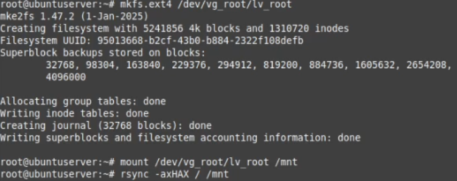
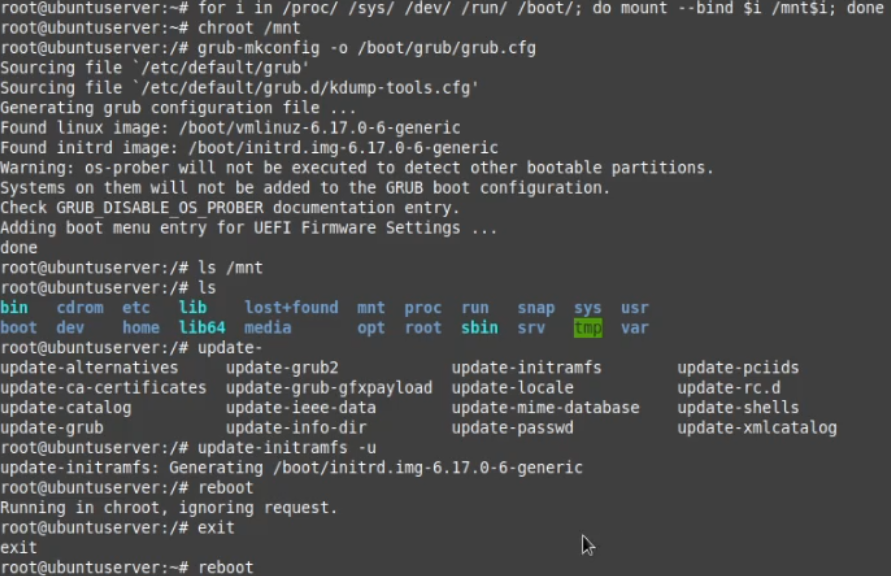
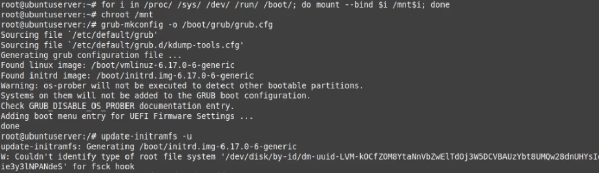
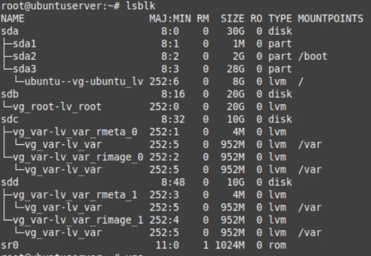
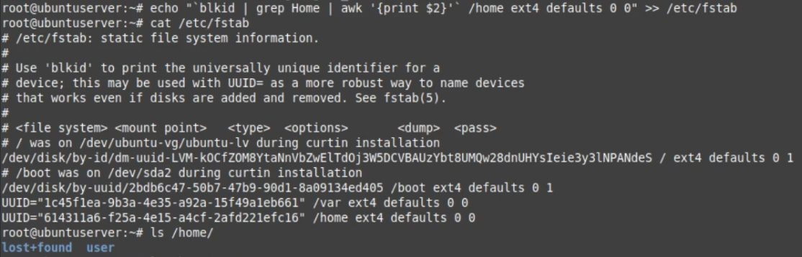
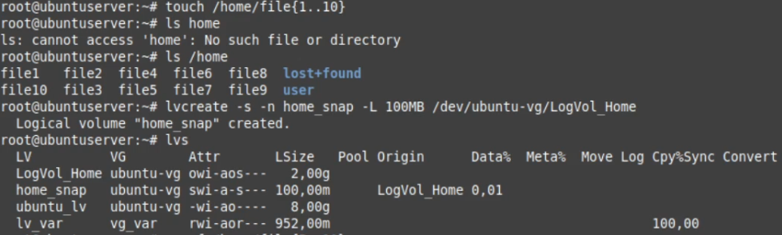
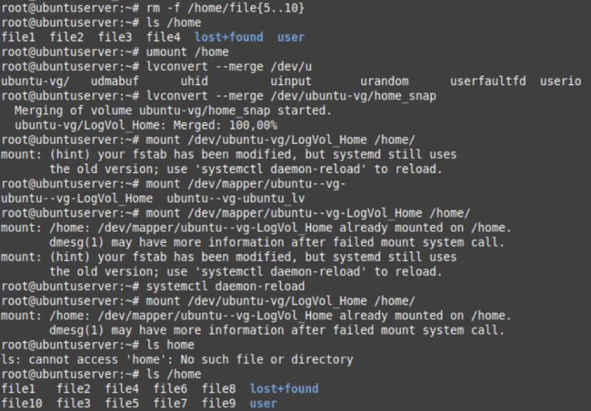

# Работа с LVM - Домашняя работа

Начинаю с чистой Ubuntu Server 24.04, смотрю как сейчас выглядят разделы.
Создаю временный раздел под перенос /.

Создаю на нём файловую систему, монтирую и копирую туда всё с /.

Делаю chroot и обновляю загрузчик, потом перезагружаюсь.

После перезагрузки проверяю что / монтируется на временный раздел.
Пересоздаю старый раздел с нужным размером.

Создаю на нвом разделе ФС, монтирую, обратно копирую /.

Опять делаю chroot и обновляю загрузчик.

Создаю раздел для var использую два диска, делаю на нем ФС, монтирую и переношу var.
Дописываю правило монтирования в fstab.

Смотрим на получившиеся разделы

Удаляю временный раздел

Создаю раздел для home, создаю на нем ФС, монтирую и копирую туда home. 
Удаляю старый home и монтирую на его место новый.

Опять дополняю fstab

Закидываю в home файлов и делаю снапшот

Удалюя некоторые файлы, затем откатываюсь через снапшот и проверяю что всё на месте.

