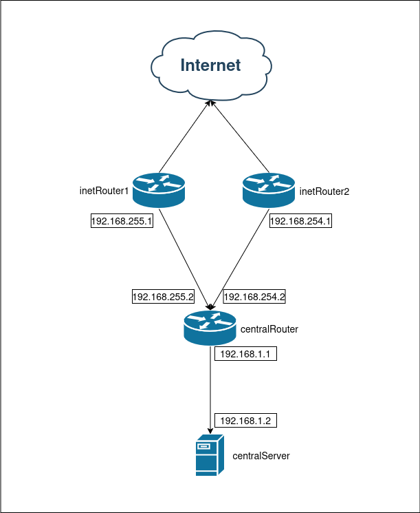
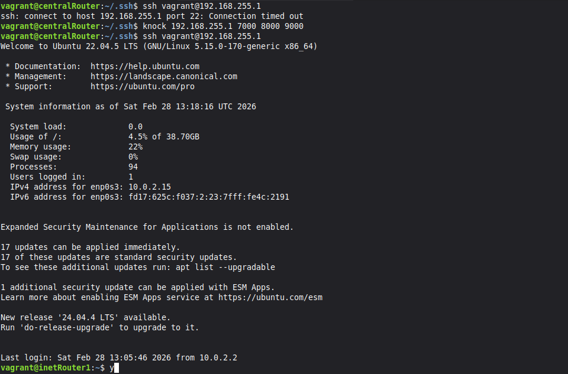
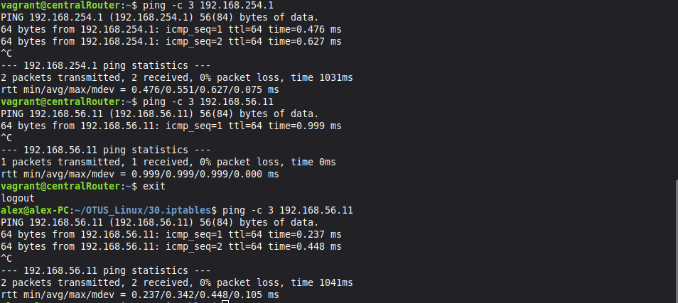
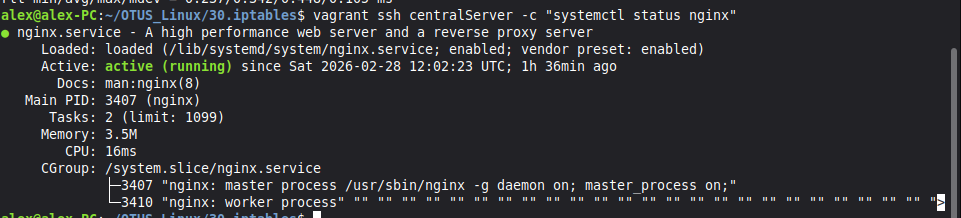
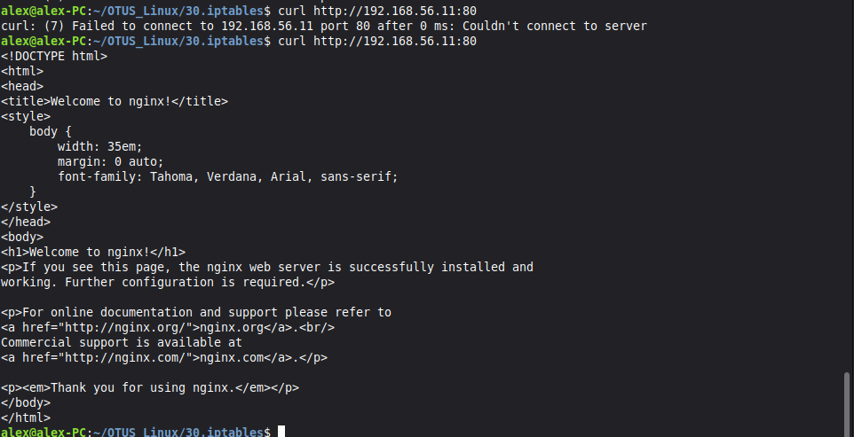
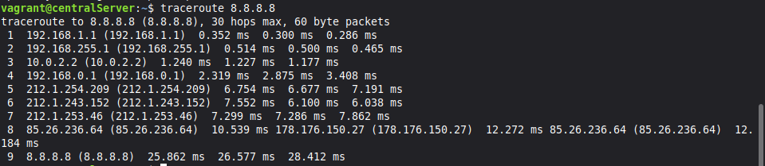

# Домашняя работа - iptables
 
1. Реализовать port knocking. centralRouter может попасть на SSH inetRouter через
knock скрипт, пример в материалах.
2. Добавить inetRouter2, который виден (маршрутизируется — host-only тип сети
для виртуалки) с хоста или форвардится порт через локалхост.
3. Запустить nginx на centralServer.
4. Пробросить 80-й порт на inetRouter2 8080.
5. Дефолт в инет оставить через inetRouter

Конфиг [Vagrantfile](./Vagrantfile) позаимствован из предыдущего задания и немного изменен, он разворачивает нужную сеть для задания:

Провижинг запускает [playbook.yml](./ansible/playbook.yml) который устанавливает необходимый сфот на хосты.

Плейбук [networkcfg.yml](./ansible/networkcfg.yml) настраивает сеть, фарвардинг на роутерах, выключает автополучение маршрутов и подкидывает конфиги с натроенной маршрутизацией.

Теперь можно приступить к заднию, сперва выполним плейбук [knockd-setup.yml](./ansible/knockd-setup.yml) который настроит первый роутер. Но сначала надо пробросить на него ключ с centralRouter, потом порт 22 будет недоступен и этого сделать не получится. 

Теперь проверяю, сначала просто попробую зайти по ssh, но получаю таймаут. Теперь делаю knoking и пытаюсь ещё раз. Всё срабатывает и попадаю на роутер.

Вагрант сделал всё за меня, проверяю что второй роутер доступен отовсюду.

Nginx уже установлен на centralServer, проверяю его состояние.

Проверяю ресурс nginx с главного хоста, недоступен. Плейбук [forwarding-nginx.yml](./ansible/forwarding-nginx.yml) меняет настройки nginx и настраивает форвардинг. Пробую после применения, всё работает.

В конце проверяю что выход в интернет работает с первого роутера.

