# Домашняя работа - OSPF
 
## Задание

1. Поднять три виртуалки
2. Объединить их разными vlan
- настроить OSPF между машинами на базе Quagga;
- изобразить ассиметричный роутинг;
- сделать один из линков "дорогим", но что бы при этом роутинг был
симметричным.

## Решение

Конфиг [Vagrantfile](./Vagrantfile) разворачивает сеть с тримя роутерами:
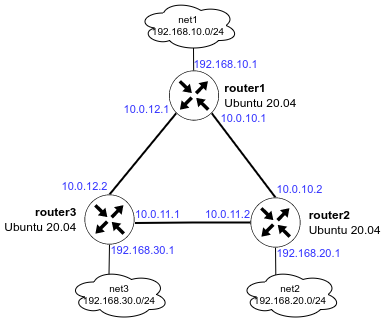

Провижинг запускает [provision.yml](./ansible/provision.yml) в котором происходит установка и зупуск нужного софта. 

В шаблоне [frr.conf.j2](./ansible/templates/frr.conf.j2) приписываем все настройки для OSPF на всех роутерах.

## Настроейки роутера

Проверяем соседство на всех роутерах.

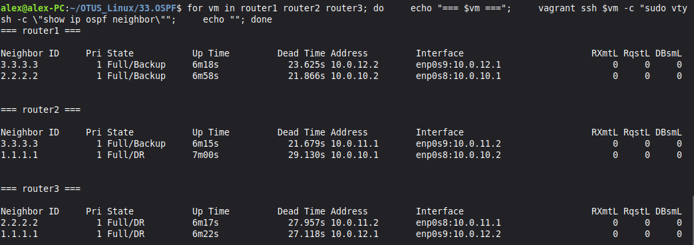

Теперь посмотрим маршруты. Сети настроенны корректно.

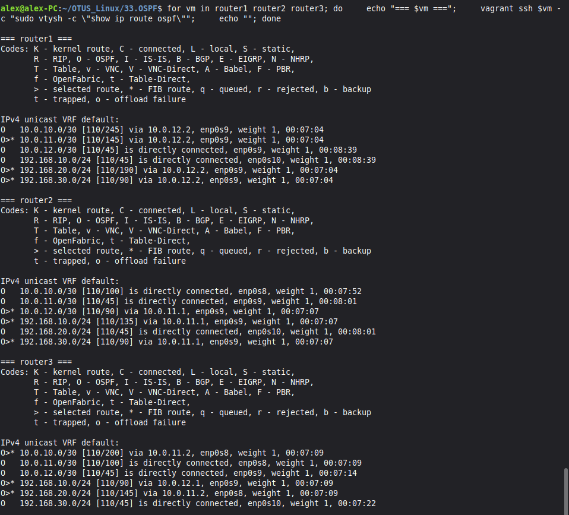

## Ассиметричный роутинг

Начнем с просмотра стоимости маршрутов, enp0s8 на первом роутере стоит 1000.

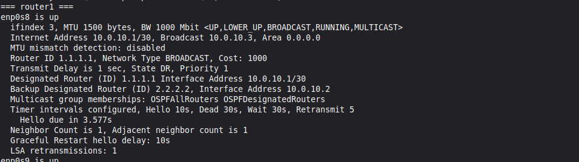

Этот же интерфейс на втором роутере стоит 45.

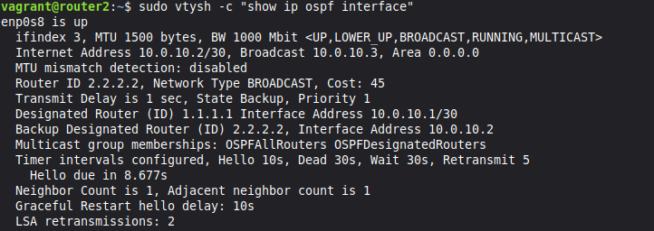

Делаем пинг интерфейса 192.168.20.1, мы должны увидеть, что запрос ICMP проходит через enp0s8, а ответ через enp0s9, т.к. в обратную сторону он стоит 45 вместо 1000.

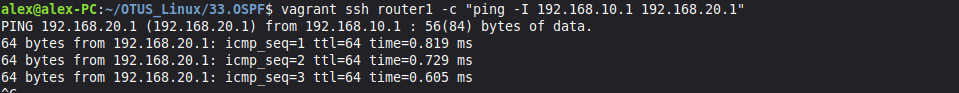

Это мы наблюдаем на enp0s8.

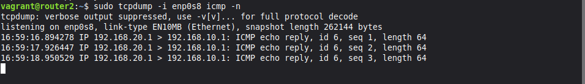

И на enp0s9. Ассиметричный роутинг.

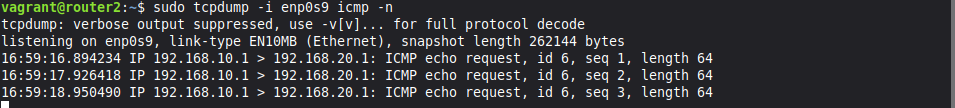

## Симетричный роутинг

Чтобы сделать роутинг симметричным, уровняем стоимость интерфейса enp0s8.

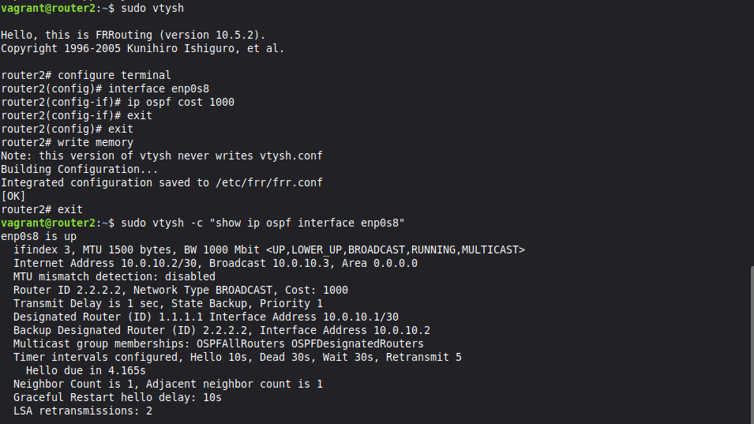

Опять делаем пинг и видим что картина поменялась.

Теперь весь трафик идет через один интерфейс.

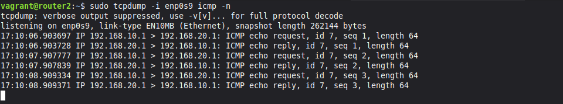

Видим что это работает в обе стороны.

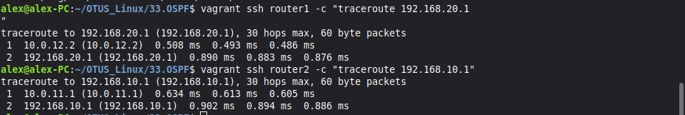
