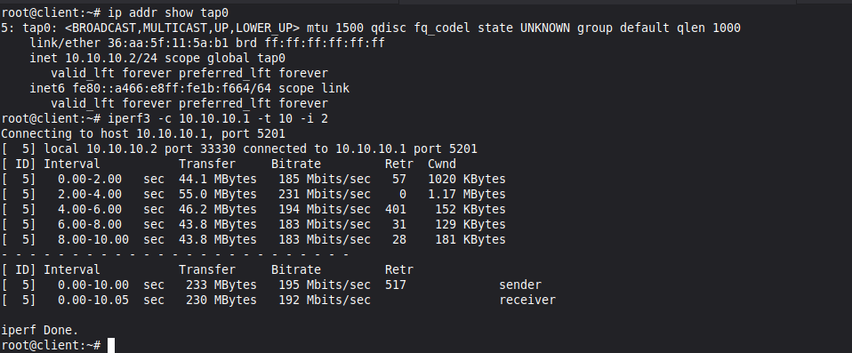
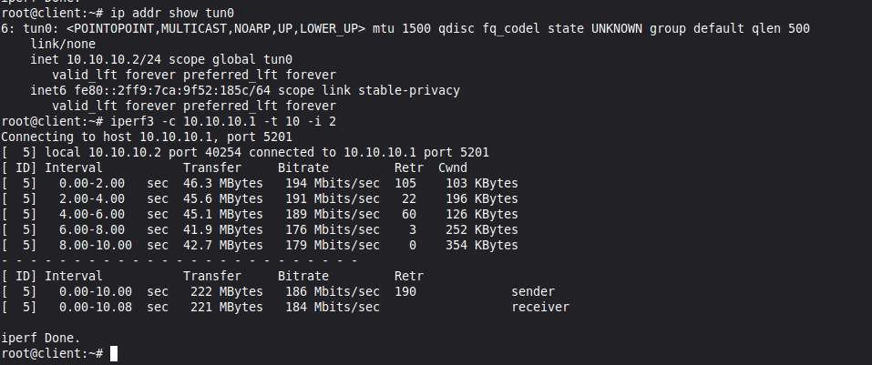
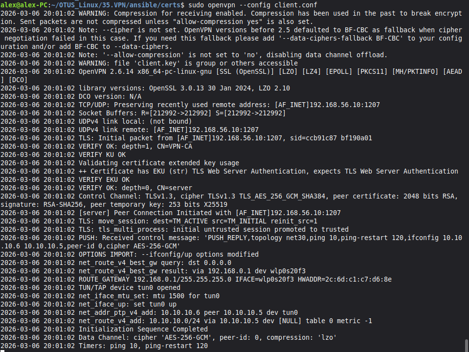
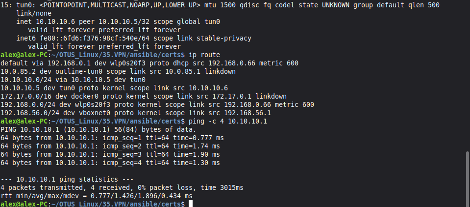

# Домашняя работа - VPN
 
1. Настроить VPN между двумя ВМ в tun/tap режимах, замерить скорость в туннелях, сделать вывод об отличающихся показателях
2. Поднять RAS на базе OpenVPN с клиентскими сертификатами, подключиться с локальной машины на ВМ

## Задание №1

Конфиг [Vagrantfile](./Vagrantfile) поднимает две виртуальные машины server и client.

Сперва запускаем плейбук [VPN.yml](./ansible/VPN.yml) в котором сразу устанавливаем нужный софт, генерируем статический ключ для шифрования и аутентификации, подкидываем конфигурации для openvpn на оба хоста и поднимаем демона iperf3 на сервере для проведения замеров. Через переменную vpn_mode будем менять режим адаптера.

После выполнения плейбука протистируем соединение на tap.

Теперь меняем переменную на tun, запускаем снова плейбук и запускаем тест еще раз.

### Сравнение производительности

| Параметр | TUN | TAP |
|----------|-----|-----|
| Пропускная способность | 184 Mbits/sec | 192 Mbits/sec |
| Ретрансмиссии | 190 | 517 | 
| Уровень OSI | 3 (сетевой) | 2 (канальный) |
| Тип трафика | IP-пакеты | Ethernet-кадры |

Вывод: Режим TUN эффективнее, пропускная способность почти одинаковая, однако кол-во ретрансмиссий почти в 3 раза меньше (190 < 517), получается что соединение более стабильное и более производительное.

## Задание №2

Для второго задания написан отдельный плейбук [RAS.yml](./ansible/RAS.yml). В нём настраиваем server, генерируем ключи и сертификаты для сервера и клиента, создаем нужные директории, подкидываем готовые конфиги для работы openvpn, и забираем ключи на локальный хост для дальнейшего подключения. 

Чтобы подключиться к тунелю с локального хоста, пишем конфиг [client.conf](./ansible/certs/client.conf) и используем его для подключения.

Подключение выполнено, в новой вкладке терминала проверяем что нужный маршрут прилетел и пинги проходят.

