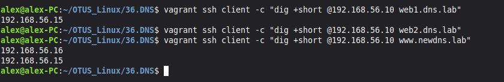
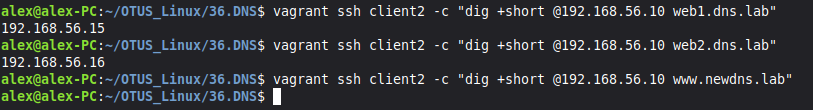
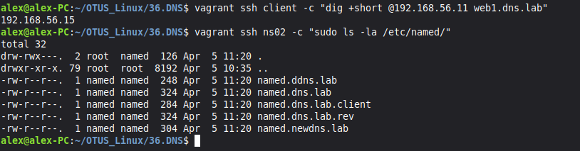

# Домашняя работа - DNS
 
## Задание

1. Развернуть 4 ВМ (`ns01`, `ns02`, `client`, `client2`) 
2. Настроить зону `dns.lab`:
   - `web1` → `client` (192.168.56.15)
   - `web2` → `client2` (192.168.56.16)
3. Создать зону `newdns.lab` с записью `www`
4. Реализовать Split-DNS через BIND views:
   - `client` видит обе зоны, но в `dns.lab` доступна только `web1`
   - `client2` видит полную зону `dns.lab` (`web1`+`web2`), но не имеет доступа к `newdns.lab`
5. Настроить репликацию зон на slave-сервер (`ns02`)

## Решение

В [Vagrantfile](./Vagrantfile) добавлен client2, вся предварительная настройка происходит с помощью провижинга в [playbook.yml](./provisioning/playbook.yml).

Добавляем записи хостов в конец [named.dns.lab](./provisioning/named.dns.lab).
Создаем новую зону [named.newdns.lab](./provisioning/named.newdns.lab).
Ограничиваем видимость для client отдельной зоной [named.dns.lab.client](./provisioning/named.dns.lab.client).
Создаем ACL-группы и настраиваем репликацию в [master-named.conf](./provisioning/master-named.conf) и [slave-named.conf](./provisioning/slave-named.conf).

После запуска стенда и провижинга делаем проверку:

1. Проверяем разрешение имём с client

vagrant ssh client -c "dig +short @192.168.56.10 web1.dns.lab"
Ожидаем: 192.168.56.15

vagrant ssh client -c "dig +short @192.168.56.10 web2.dns.lab"
Ожидаем: (пусто)

vagrant ssh client -c "dig +short @192.168.56.10 www.newdns.lab"
Ожидаем: 192.168.56.15 ИЛИ 192.168.56.16

2. Проверяем разрешение имём с client2

vagrant ssh client2 -c "dig +short @192.168.56.10 web1.dns.lab"
Ожидаем: 192.168.56.15

vagrant ssh client2 -c "dig +short @192.168.56.10 web2.dns.lab"
Ожидаем: 192.168.56.16

vagrant ssh client2 -c "dig +short @192.168.56.10 www.newdns.lab"
Ожидаем: (пусто)

3. Проверяем репликацию на ns02

vagrant ssh client -c "dig +short @192.168.56.11 web1.dns.lab"
Ожидаем: 192.168.56.15

vagrant ssh ns02 -c "sudo ls -la /etc/named/"
Ожидаем: файлы существуют

