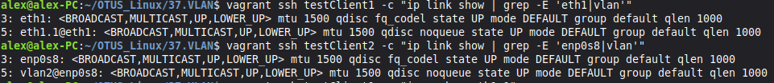
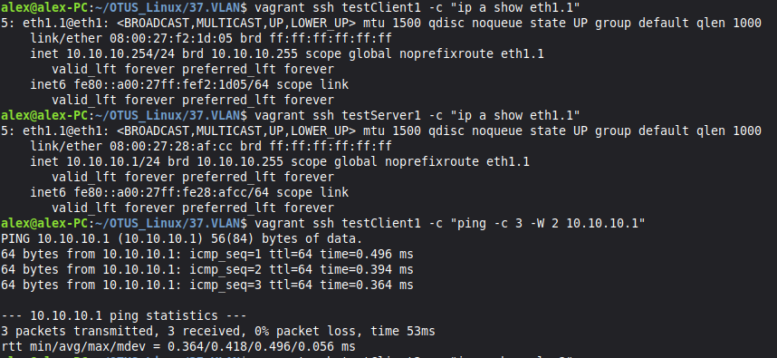
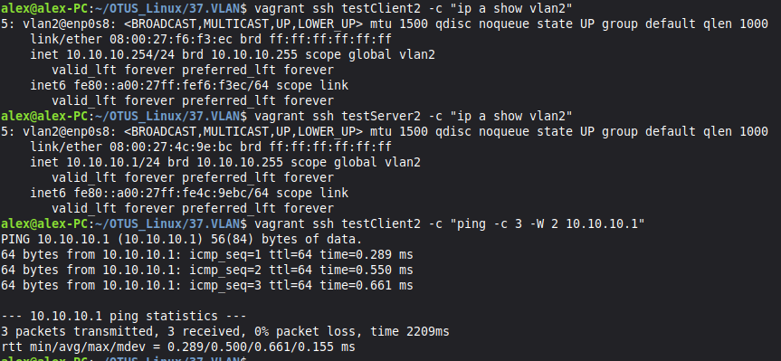
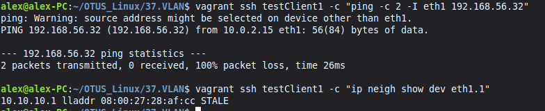
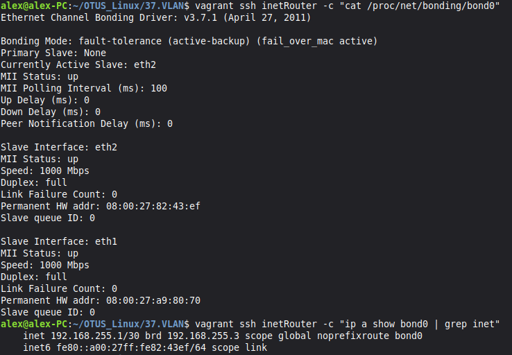
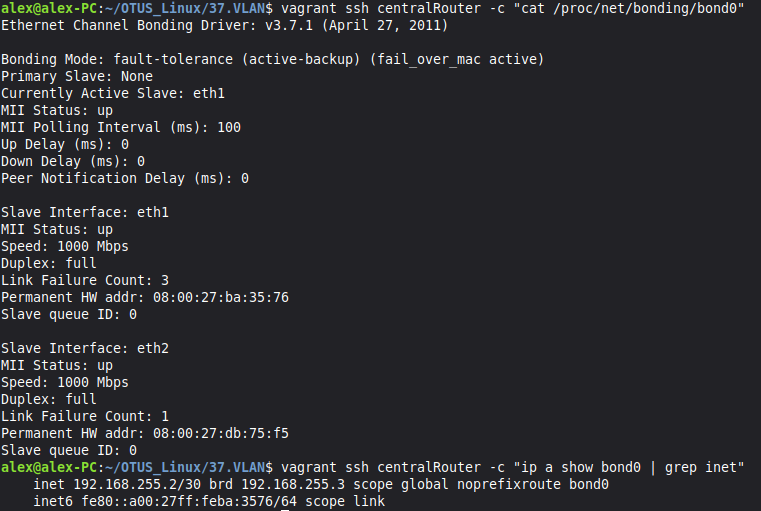
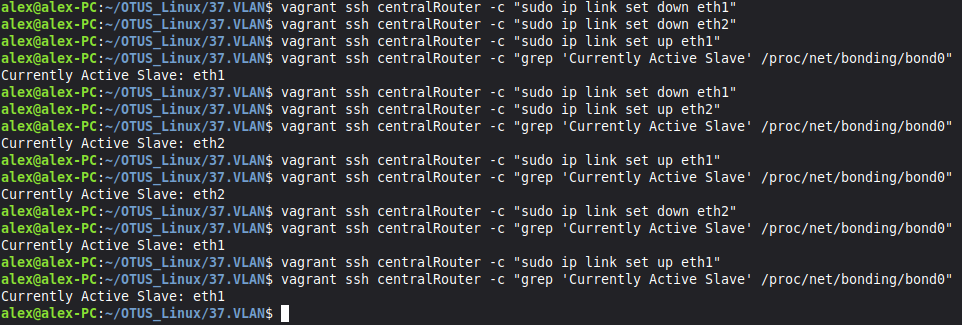
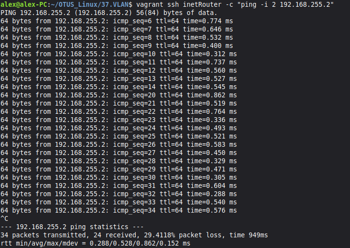

# Домашняя работа - VLAN
 
## Задание

в Office1 в тестовой подсети появляется сервера с доп интерфейсами и адресами
в internal сети testLAN: 
- testClient1 - 10.10.10.254
- testClient2 - 10.10.10.254
- testServer1- 10.10.10.1 
- testServer2- 10.10.10.1

Развести вланами:
testClient1 <-> testServer1
testClient2 <-> testServer2

Между centralRouter и inetRouter "пробросить" 2 линка (общая inernal сеть) и объединить их в бонд, проверить работу c отключением интерфейсов

## Решение

В [Vagrantfile](./Vagrantfile) создаю 7 ВМ, после чего запускаю плейбук [playbook.yml](./ansible/playbook.yml). В нем устанавливаются утилиты и с помощью шаблонов настраиваются виланы и бондинг. После запуска стендов и плейбука можно переходить к проверке.

Проверяем что на хостах появился интерфейс для VLAN

Проверим работу VLAN1

Проверим работу VLAN2

Проверяю что трафик между VLAN 1 и VLAN 2 не проходит, несмотря на совпадающие IP-подсети

Проверяю Bond-интерфейс на inetRouter

И на centralRouter

Протестируем отказойстойчивость. Буду пинговать ip бонда на centralRouter, в это же время буду отключать интерфейсы поочередно.

В результуте вижу что пакеты терялясь только когда оба интерфейса были отключены. В случае если хотя бы один интерфейс поднят, пакеты проходят без потерь.

