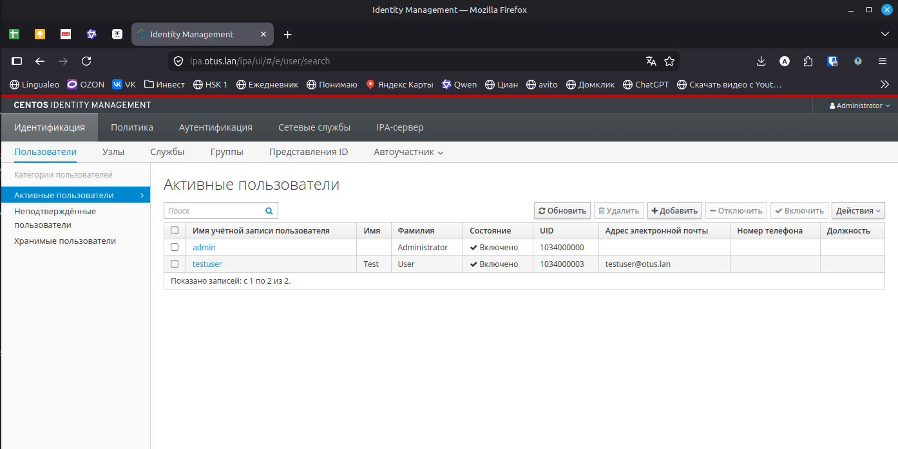
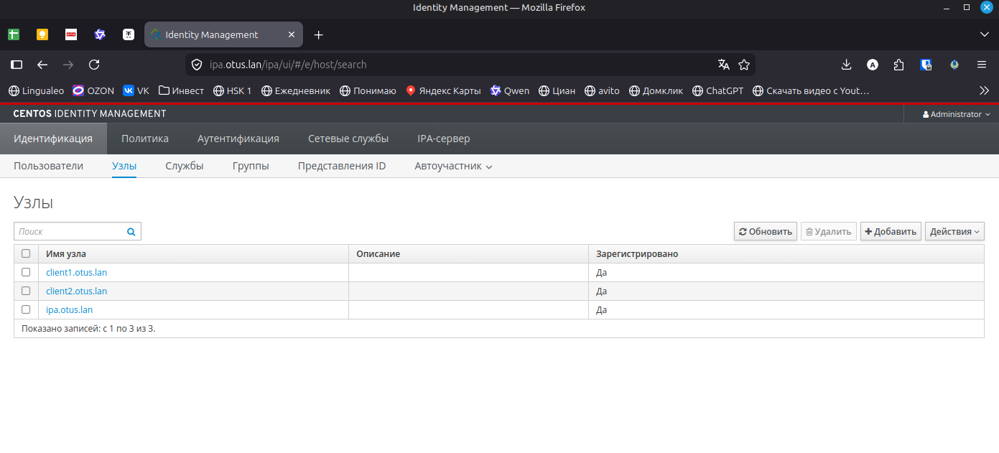
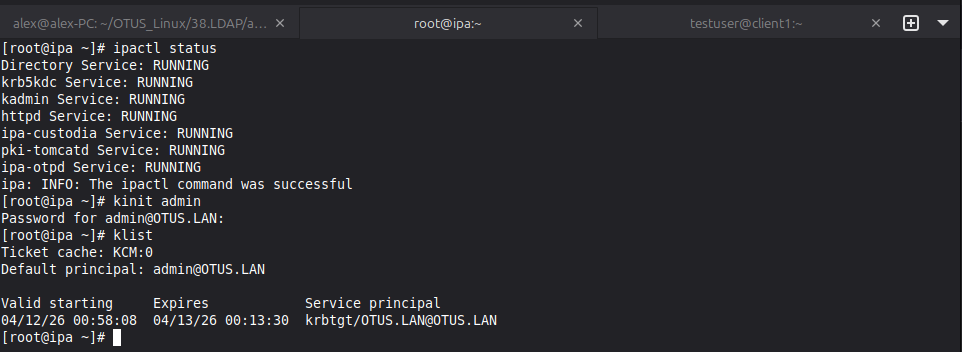

# Домашняя работа - LDAP
 
## Задание

1. Установить FreeIPA
2. Написать Ansible-playbook для конфигурации клиента

## Решение

В [Vagrantfile](./Vagrantfile) создаю сервер и два клиента, после это запускаю плейбук [provision.yml](./ansible/provision.yml). В нём исправляю репозитории, устанавливаю необходимый софт, устанавливаю FreeIPA и сразу настраиваю сервер и клиенты. После запуска стендов и плейбука можно переходить к проверке. В рамках теста так же создал тестового пользователя.

На локал хосте нужно прописать в host адрес, чтобы через браузер корректно открывалась панелька https://ipa.otus.lan/ipa. 

Во вкладке узлов видим все ранее поднятые машины.

Так же можем посмотреть сервер из консоли.

