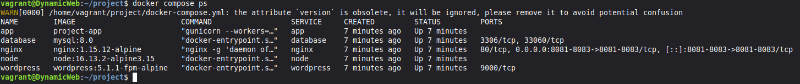
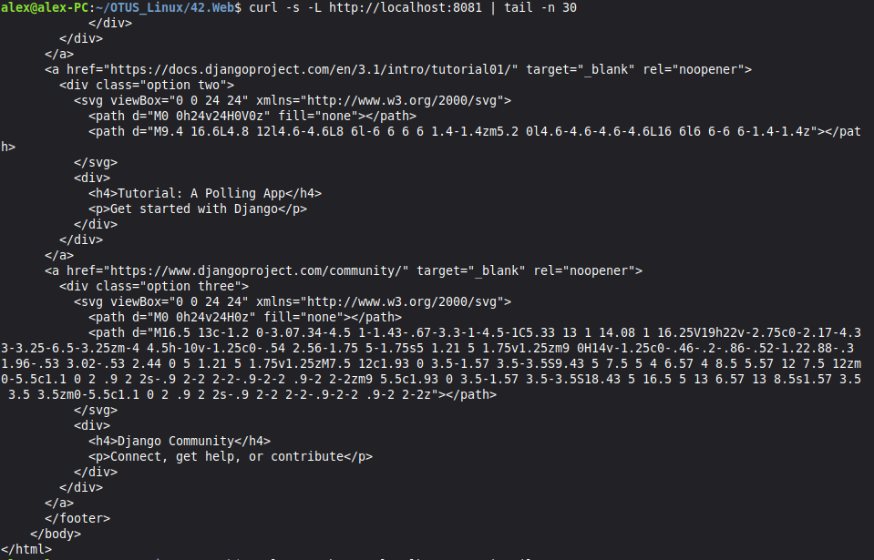
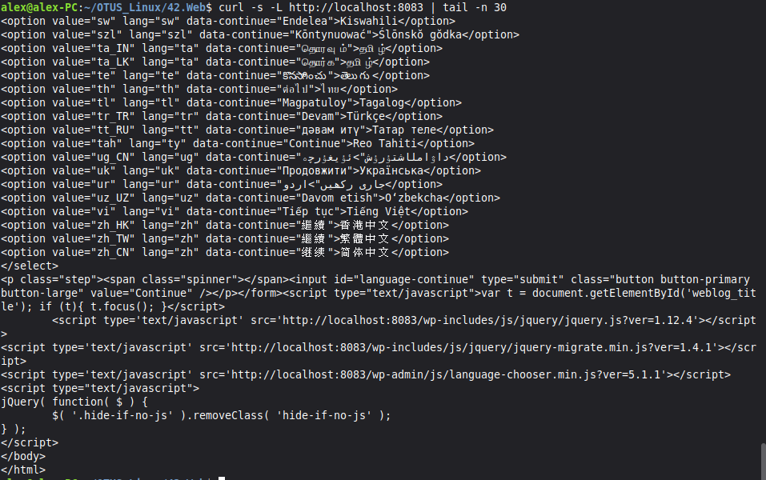
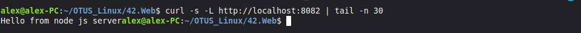

# Домашняя работа - Dynamic Web
 
## Задание

Развернуть стенд nginx + php-fpm (wordpress) + python (django) + js(node.js) с деплоем через docker-compose.

## Решение

В [Vagrantfile](./Vagrantfile) создаю 1 ВМ, после создания сразу запускается провижинг [provision.yml](./provision.yml). В нем устанавливаются утилиты, докер, копурую каталог с проектом и поднимаю его.

Контейнеры описаны в [docker-compose.yml](./project/docker-compose.yml), Все запросы проходят через Nginx, который выполняет роль reverse-proxy. Контейнеры изолированы в общей Docker-сети app-network и взаимодействуют по внутренним DNS-именам. 

После отработки скриптов сначала проверю что контейнеры поднялись, захожу на ВМ, вижу что всё работает.

Использую curl, проверяю Django на 8081 порте.

Потом WordPress на 8083 порте.

И Node.js на 8082 порте.

