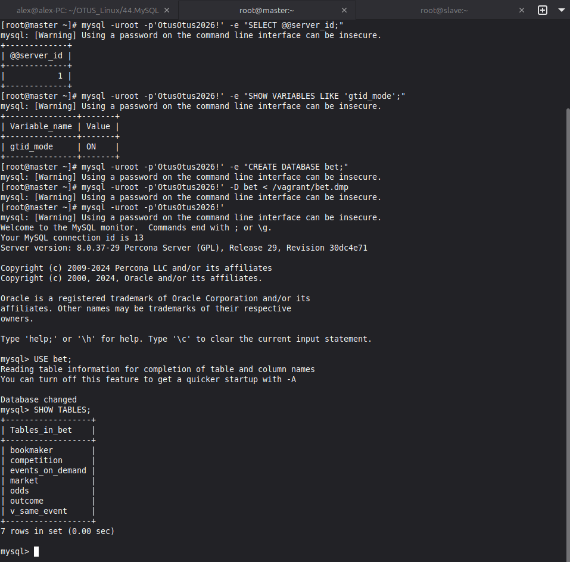
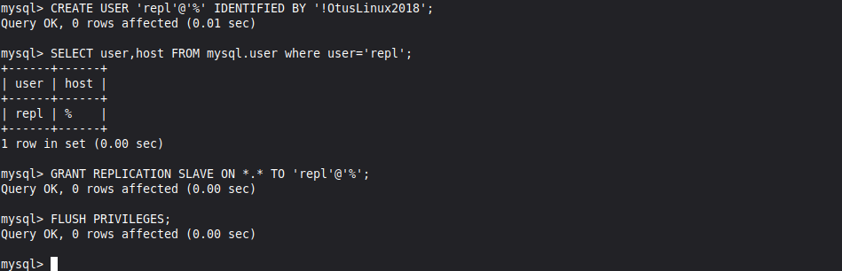
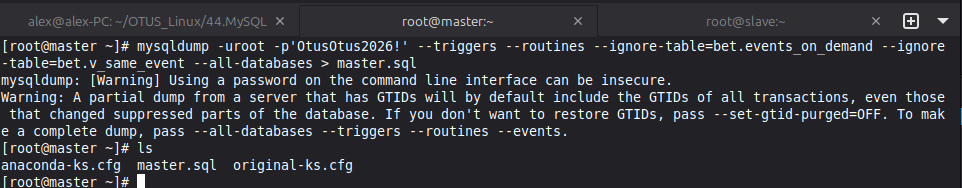
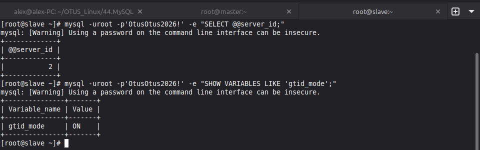
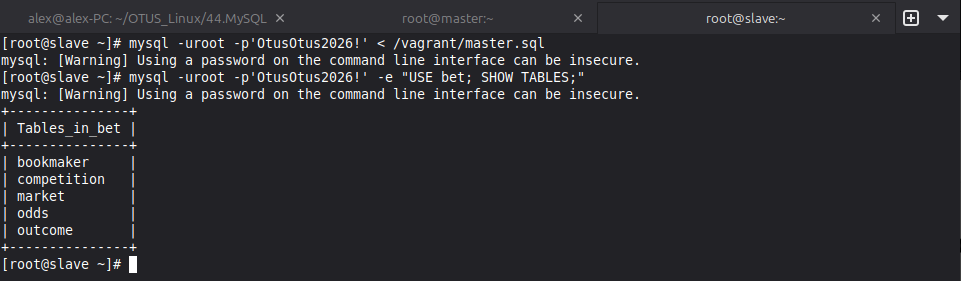
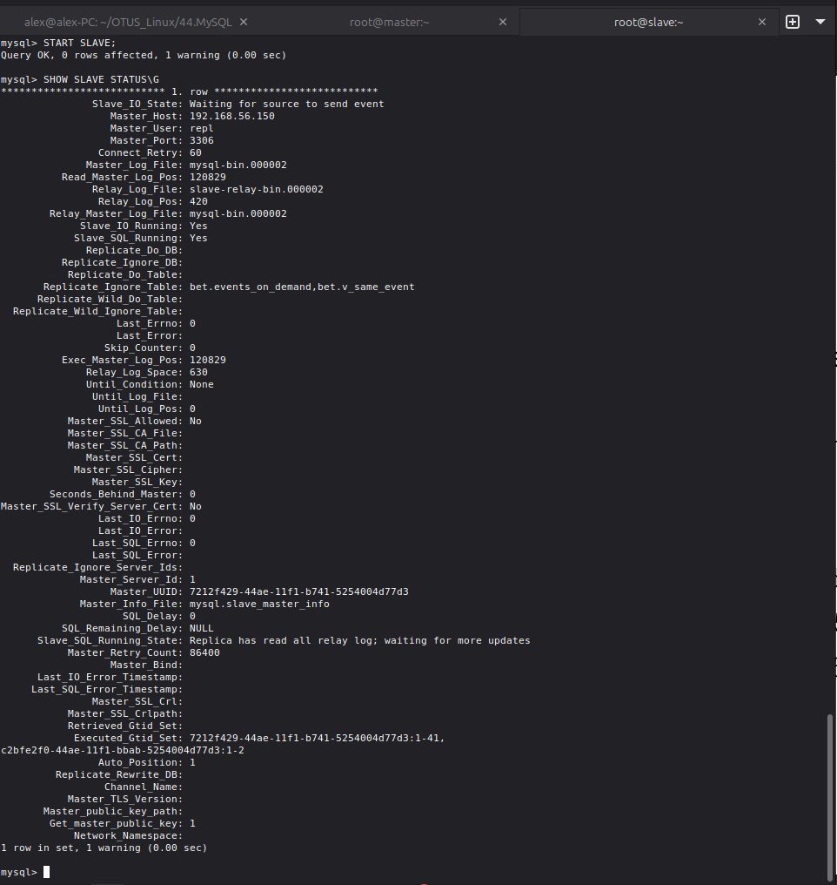
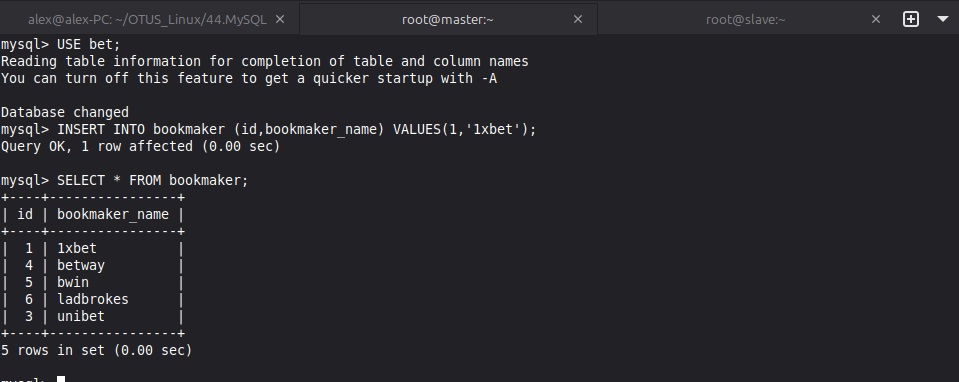
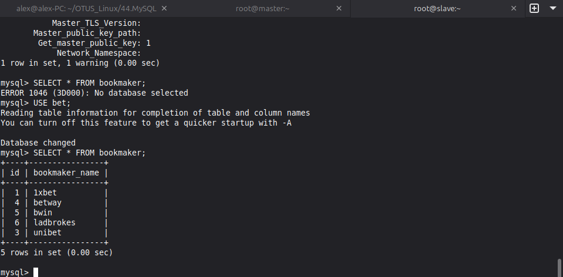

# Домашняя работа - MySQL
 
## Задание

Настроить GTID репликацию

## Решение

В [Vagrantfile](./Vagrantfile) создаю 2 ВМ - Master и Slave

Провижингом [provision.yml](./provision.yml) при создании ВМ настраиваю сразу оба хоста - Исправляю репозитории, добавляю нужные для задания, устанавливаю Percona Server, копирую папку с конфигами и вношу правки в них, наконец запускаю MySQL и меняю временныйц пароль на свой.

После установки и настройки перехожу к выполнению задания. На Мастере проверяю server_id и включенный GTID, почле чего создаю базу данный и подкидываю в неё дамп из задания. В конце проверяю что всё подгрузилось.

Создаю юзера для репликации и выдаю ему права.

Делаю дамп базы без двух таблиц и перекидываю его на Slave.

На Slave так же проверяю server_id и включенный GTID

Подкидываю БД, проверяю таблицы.

Подключаю и запускаю слейв, проверяю параметры, всё ок.

На мастере создаю новую запись в таблице bookmaker.

Проверяю что эта запись появилась на Slave, всё работает.

