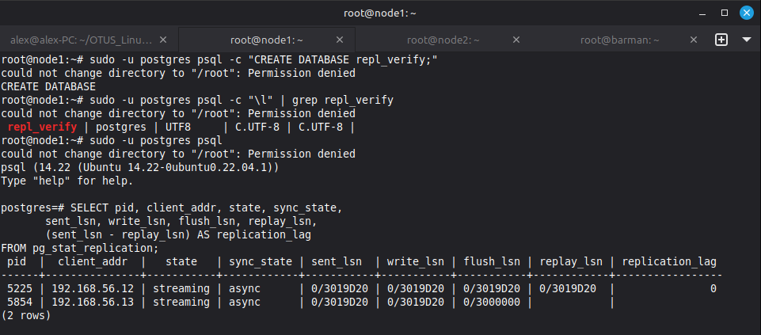
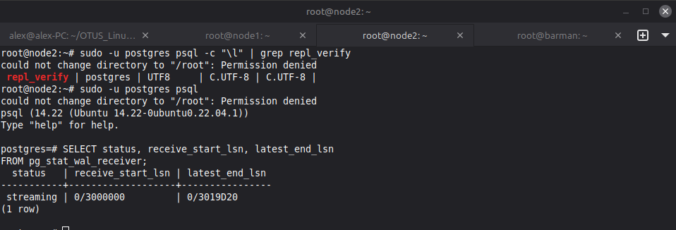
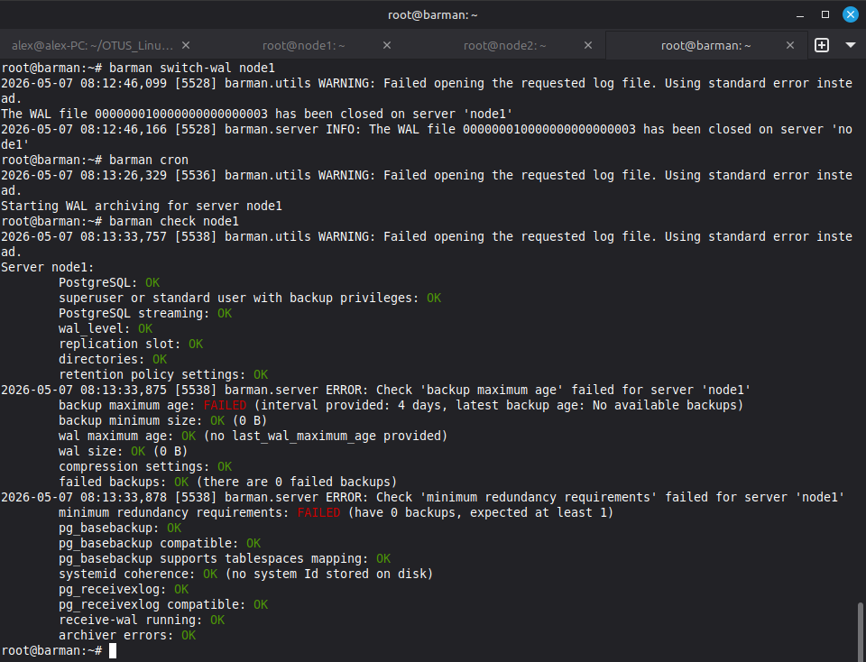
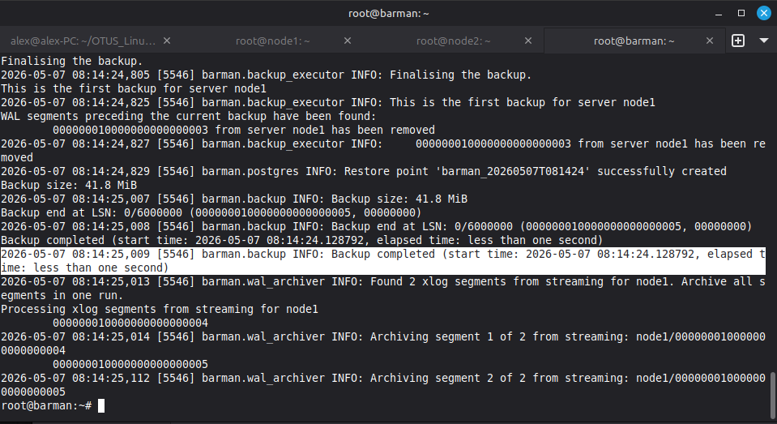
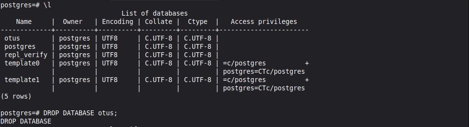
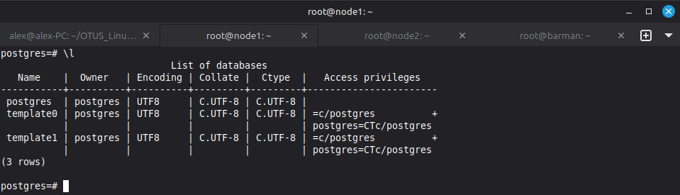
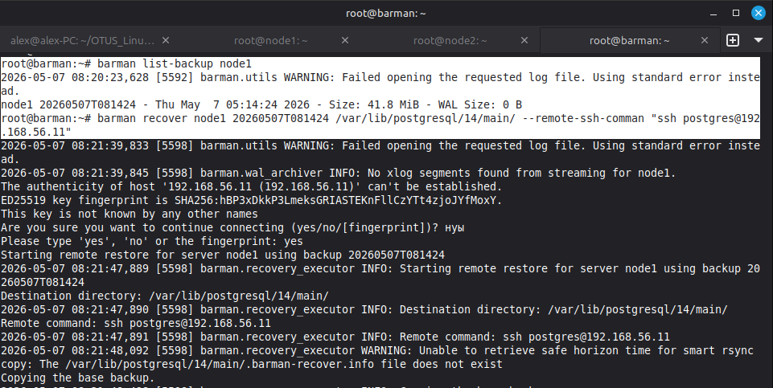
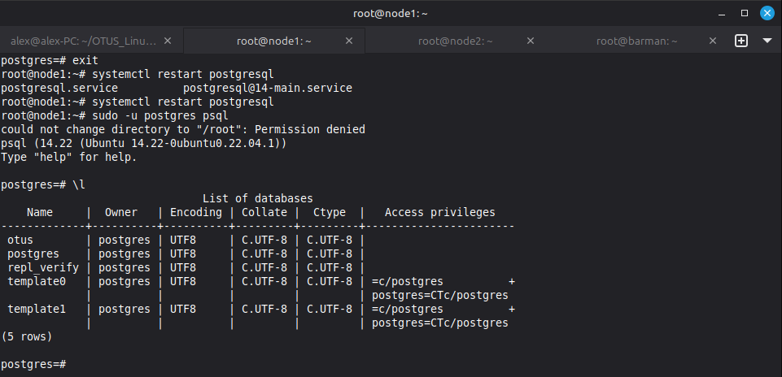

# Домашняя работа - PgSQL
 
## Задание

1) Настроить hot_standby репликацию с использованием слотов
2) Настроить правильное резервное копирование

## Решение

В [Vagrantfile](./Vagrantfile) создаю 3 ВМ - node1(Master), node2(Slave) и Barman

Провижингом [provision.yml](./provision.yml) при создании ВМ настраиваю сразу все хосты - Установка нужных утилит и  PgSQL на ноды, подкидываю готовые конфиги для PgSQL через шаблоны, настраиваю репликацию. Тоже самое для резервного копирования - Сталю Barman, подкидываю конфиги, прокидываю ssh-ключи, создаю пользователя и таблицу. По итогу получаю готовый стенд, остается только протестировать.

Для нача проверю работу репликации, создам таблицу на node1.

Через пуру секунд проверяю что она появилась на node2. Репликация работает.

Теперь проверю работу bardman, запускаю архивирование на node1.

Запускаю резервное копирование, жду завершения. 

Теперь для теста удалим базу otus с node1

База удалена, будем пробовать восстанавливать из бекапа.

Иду на Barman и из списка существующих бекапов запускаю нужный. 

После этого возвращаюсь на ноду, перезапускаю pg и проверяю что база вернулась на место. Бекапы работают.

