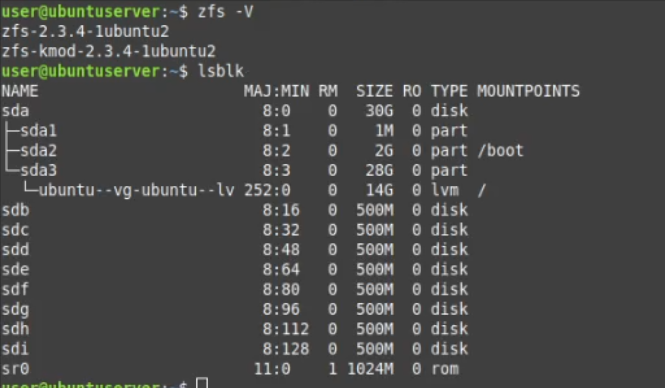
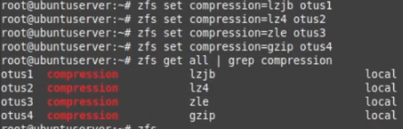
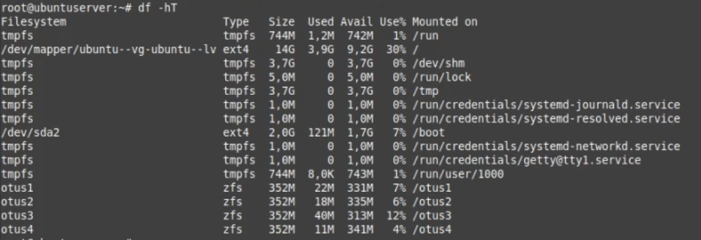
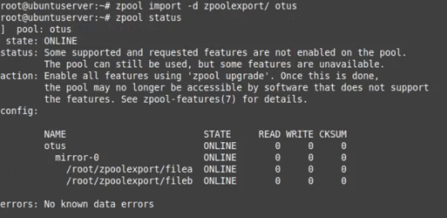
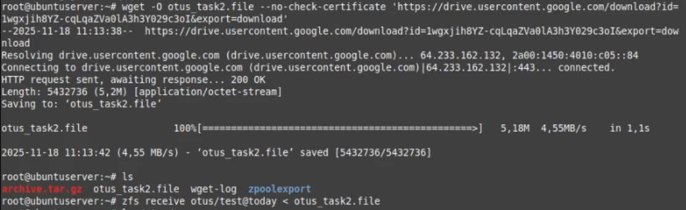
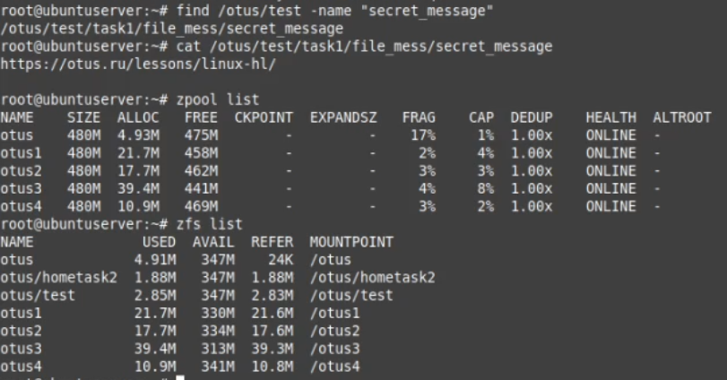

# Работа с ZFS - Домашняя работа

# 1.Определить алгоритм с наилучшим сжатием
Запускаю подготовленную Ubuntu Server, проверяю софт для ZFS и диски

Создаю пуллы из RAID1, проверяю результат

Для каждого пулла устанавливаю свой алгоритм сжатия 

Скачиваю в каждый пулл одинаковые логи

Проверяю что всё скачалось и смотрю как отработали алгоритмы, лучшим оказался gzip

# 2.Определить настройки пула

Скачиваю и распаковываю сторонний архив с пуллом

Импортирую его и проверяю статус

После ипморта просматриваем параметры импортированного пулла

# 3.Работа со снапшотами

Скачиваю файл из директории и восстанавливаю ФС через снапшот 

Нахожу и читаю нужный файл

