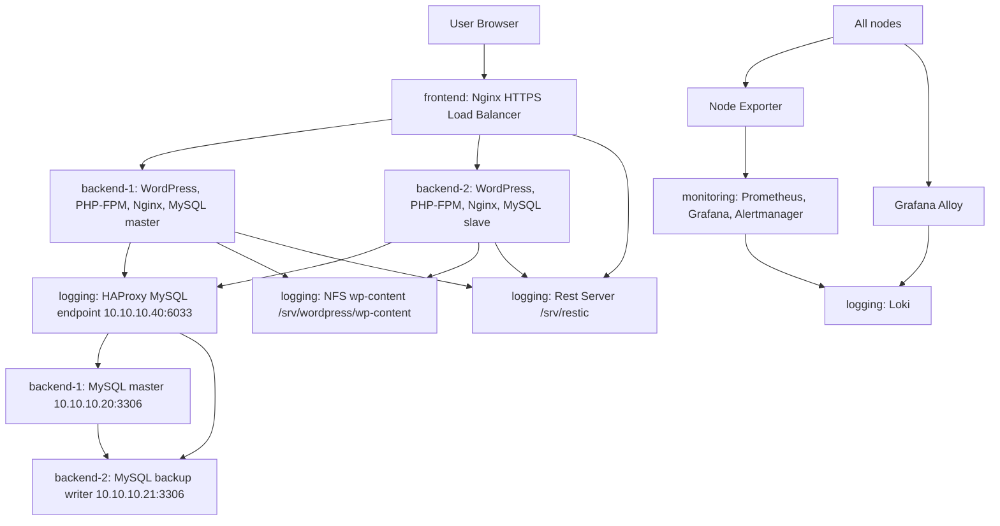

# Архитектура проекта OTUS Linux Diploma

## Назначение проекта

Проект разворачивает демонстрационную отказоустойчивую инфраструктуру WordPress-форума в Vagrant/VirtualBox. Цель стенда - показать автоматизированное развёртывание, отказоустойчивость backend-узлов, централизованные backup, мониторинг, логирование и firewall-настройки.

Стенд строится Ansible playbook-ами из каталога `ansible/`. Общий provision запускается через VM `logging`, потому что она последняя в `Vagrantfile` и содержит Ansible provisioner.

## Общая схема



Главная идея текущей версии: `monitoring` больше не является runtime-зависимостью WordPress. Критичное общее состояние вынесено на `logging`: HAProxy для БД, NFS для `wp-content`, Rest Server и Restic repositories.

## Виртуальные машины

| VM           | Management IP   | Service IP    | Назначение                                      | Host ports |
| ------------ | --------------- | ------------- | ----------------------------------------------- | ---------- |
| `frontend`   | `192.168.56.10` | `10.10.10.10` | HTTPS-точка входа и Nginx load balancer         | SSH `2201` |
| `backend-1`  | `192.168.56.20` | `10.10.10.20` | WordPress worker и MySQL master                 | SSH `2202` |
| `backend-2`  | `192.168.56.21` | `10.10.10.21` | WordPress worker и MySQL slave                  | SSH `2203` |
| `monitoring` | `192.168.56.30` | `10.10.10.30` | Prometheus, Grafana, Alertmanager               | SSH `2204` |
| `logging`    | `192.168.56.40` | `10.10.10.40` | Loki, HAProxy, NFS, Rest Server, Restic storage | SSH `2205` |

Сервисная сеть `10.10.10.0/24` используется для взаимодействия VM между собой. Management-сеть `192.168.56.0/24` используется для SSH/Ansible.

## Входные точки

- WordPress: `https://lab.diplom.com/`
- Grafana: `https://lab.diplom.com/grafana/`
- Prometheus: `https://lab.diplom.com/prometheus/`
- Alertmanager: `https://lab.diplom.com/alertmanager/`

Внешний HTTP/HTTPS-доступ к веб-интерфейсам идёт только через `frontend` по host-only IP `192.168.56.10`. На host OS запись `/etc/hosts` должна указывать `lab.diplom.com` на `192.168.56.10`. Прямые host port forwards для веб-интерфейсов не используются.

WordPress admin credentials:

```text
admin / DemoAdmin123!
```

## Grafana dashboard

Основной dashboard находится в Grafana по адресу `https://lab.diplom.com/grafana/` и разворачивается из шаблона `ansible/templates/grafana/node-overview-dashboard.json.j2`.

Источник данных - Prometheus. Он опрашивает `node_exporter` на всех VM каждые `10s`. Для удобства демонстрации каждому target назначены labels:

- `frontend` - входная точка WordPress и Nginx load balancer;
- `backend-1` - WordPress backend и MySQL master;
- `backend-2` - WordPress backend и MySQL slave;
- `monitoring` - Prometheus, Grafana, Alertmanager;
- `logging` - Loki, HAProxy, NFS, Rest Server.

Dashboard специально считает метрики через label `node`, а не через `IP:port`. Поэтому в легендах отображаются понятные имена узлов. Для ресурсных метрик используется привязка к `up{job="nodes"}`: если VM выключена и `node_exporter` недоступен, значения CPU, memory, disk, uptime, load и network для этой VM становятся `0`. Это сделано для демонстрации, чтобы выключенный сервер не выглядел как продолжающий работать по последним старым метрикам Prometheus.

### Верхний ряд

`Nodes Up` Показывает количество доступных узлов из группы `nodes`. Считается как сумма `up{job="nodes"}`. В нормальном состоянии значение равно `5`. Если один backend выключен, значение становится `4`.

`Nodes Down`

Показывает количество недоступных узлов. Считается как `sum(1 - up{job="nodes"})`. Это быстрый индикатор отказа VM или `node_exporter`. Если всё работает - `0`; если выключен один backend - `1`.

`Firing Alerts`

Показывает количество активных alert-ов Prometheus. Для демонстрации отказа backend здесь появляется `1`, когда срабатывает `InstanceDown`. Детали alert-а удобнее смотреть в Prometheus `https://lab.diplom.com/prometheus/alerts` или Alertmanager `https://lab.diplom.com/alertmanager/`.

### Текущие ресурсные показатели

`CPU Usage`

Показывает текущую загрузку CPU по каждому живому узлу. Используется среднее значение по CPU cores на основе `rate(node_cpu_seconds_total{mode="idle"}[2m])`. Окно `2m` выбрано как компромисс: метрика достаточно быстро реагирует на изменения и при этом не слишком шумная.

`Memory Usage`

Показывает процент занятой оперативной памяти:

```text
1 - MemAvailable / MemTotal
```

Метрика отражает именно доступную память Linux (`MemAvailable`), поэтому она лучше подходит для оценки реальной memory pressure, чем простое `free`.

`Root Disk Used`

Показывает процент занятого места на корневой файловой системе `/`. В расчёт не попадают временные файловые системы вроде `tmpfs` и `overlay`. Нужен для быстрой проверки, что VM не упёрлась в диск.

### Runtime-показатели

`Uptime`

Показывает время с последней загрузки VM:

```text
time() - node_boot_time_seconds
```

Отображается в коротком формате `hh:mm:ss`. После пересоздания или перезагрузки VM uptime этого узла становится маленьким, что удобно показывать во время destructive demo.

`Load Average 1m`

Показывает `node_load1` - среднюю системную нагрузку за последнюю минуту. Это не процент CPU, а показатель очереди выполнения процессов. Для маленьких VM с 2 CPU значение около `0-1` обычно нормально; устойчиво высокие значения говорят о перегрузке.

### Графики во времени

`CPU Usage Over Time`

Показывает историю CPU usage за выбранный период dashboard-а. По умолчанию dashboard открыт на `now-15m`, обновление каждые `10s`. На графике удобно видеть момент отказа: у выключенного узла линия падает к `0`.

`Memory Usage Over Time`

Показывает изменение использования памяти во времени. Помогает увидеть, растёт ли потребление памяти после восстановления узла или во время нагрузки.

`Network Traffic`

Показывает входящий и исходящий сетевой трафик по каждому узлу:

- `RX` - receive bytes/sec;
- `TX` - transmit bytes/sec.

Loopback-интерфейс `lo` исключён, чтобы график показывал реальный сетевой обмен между VM.

`Load Average Over Time`

Показывает историю `node_load1`. Используется как дополнительный индикатор общей нагрузки на VM и помогает отличить кратковременный всплеск CPU от устойчивой перегрузки.

## Поток пользовательского запроса

1. Пользователь открывает `https://lab.diplom.com/`.
2. Host OS резолвит `lab.diplom.com` в host-only IP `192.168.56.10`.
3. Nginx на `frontend` принимает HTTPS и проксирует запрос в upstream `backend_pool`.
4. Upstream выбирает `backend-1` или `backend-2` по `least_conn`.
5. Backend Nginx передаёт PHP-запрос в PHP-FPM socket `/run/php/php8.1-wordpress.sock`.
6. WordPress подключается к БД через `DB_HOST = 10.10.10.40:6033`.
7. HAProxy на `logging` проксирует MySQL-трафик на `backend-1`, а при отказе master - на `backend-2`.
8. WordPress-файлы `wp-content` доступны обоим backend через NFS с `logging`.

## Порядок выполнения Ansible

`ansible/site.yml` импортирует playbook-и в следующем порядке:

1. `ha_shared.yml`
2. `back.yml`
3. `front.yml`
4. `monitoring.yml`
5. `logging.yml`
6. `alloy.yml`
7. `restic_init.yml`
8. `UFW.yml`

Порядок важен: shared-state на `logging` должен быть готов до настройки backend-ов, потому что backend-ы монтируют NFS и используют DB endpoint.

## Playbook-и

### `ansible/ha_shared.yml`

Настраивает общий state на `logging`.

Основные действия:

- создаёт системного пользователя `restic`;
- устанавливает `nfs-kernel-server`, `haproxy`, `apache2-utils`;
- открывает ранние UFW allow для `6033`, `2049`, `8000`;
- устанавливает `rest-server` из `/opt/rest-server.tar.gz`;
- создаёт `/srv/restic` и репозитории `frontend`, `backend_master`, `backend_slave`;
- создаёт `/etc/restic/.htpasswd` для Basic Auth Rest Server;
- поднимает `rest-server.service`;
- создаёт `/srv/wordpress/wp-content`;
- распаковывает demo `wp-content`, если маркера ещё нет;
- экспортирует NFS `/srv/wordpress/wp-content` для сети `10.10.10.0/24`;
- разворачивает HAProxy config и запускает `haproxy.service`.

### `ansible/back.yml`

Настраивает оба backend-узла: `backend-1` и `backend-2`.

Ключевые блоки:

- MySQL base setup: конфиг master/slave, root password, `.my.cnf`, replication user.
- WordPress DB setup: создание БД и пользователя на master.
- Master recovery chain:
  - если master пустой, но slave живой - восстановить dump со slave;
  - если slave недоступен, но есть Restic snapshot - восстановить latest SQL dump из `logging`;
  - если backup-ов нет - импортировать demo seed `forum-demo.sql`.
- WordPress files: распаковка WordPress из локального архива.
- NFS mount: подключение `10.10.10.40:/srv/wordpress/wp-content`.
- Stale NFS cleanup: при `Stale file handle` или `Input/output error` выполняется lazy/force unmount.
- PHP-FPM: отдельный pool `wordpress`.
- Nginx backend: virtual host для WordPress.
- MySQL replication: настройка slave, проверка `Slave_IO_Running` и `Slave_SQL_Running`.
- HA marker: таблица `wp_ha_check` проверяет, что запись с master доходит до slave.
- HA sync timer: периодическое грубое выравнивание БД между master/slave.
- Restic client: backup scripts и hourly systemd timer.

### `ansible/front.yml`

Настраивает `frontend`.

Основные действия:

- генерирует self-signed TLS certificate;
- разворачивает Nginx upstream на backend-ы;
- разворачивает HTTPS reverse proxy;
- удаляет default site;
- проверяет `nginx -t`;
- проверяет доступность хотя бы одного backend;
- настраивает Restic backup frontend-конфигов и TLS-ключей.

### `ansible/monitoring.yml`

Состоит из двух частей.

Первая часть ставит Node Exporter на все VM:

- создаёт пользователя `node_exporter`;
- устанавливает бинарник из `/opt/node_exporter.tar.gz`;
- разворачивает systemd unit;
- запускает `node_exporter.service`.

Вторая часть настраивает `monitoring`:

- создаёт пользователей `prometheus`, `alertmanager`;
- ставит Prometheus и Alertmanager из локальных архивов;
- создаёт директории `/etc/prometheus`, `/var/lib/prometheus`, `/etc/alertmanager`, `/var/lib/alertmanager`;
- разворачивает `prometheus.yml`, alert rules, `alertmanager.yml`;
- настраивает Grafana, datasources и dashboard provider;
- запускает `prometheus.service`, `alertmanager.service`, `grafana-server.service`.

### `ansible/logging.yml`

Настраивает Loki на `logging`.

Действия:

- создаёт пользователя `loki`;
- устанавливает бинарник из `/opt/loki.zip`;
- создаёт `/etc/loki`, `/var/lib/loki`, `/var/lib/loki/compactor`, `/var/log/loki`;
- создаёт `/var/log/loki/loki.log` для сбора логов самого Loki через Alloy;
- разворачивает `loki.yml`;
- разворачивает и запускает `loki.service`.

### `ansible/alloy.yml`

Настраивает Grafana Alloy на всех VM.

Действия:

- создаёт пользователя `alloy` и добавляет его в группу `adm`;
- устанавливает бинарник из `/opt/alloy.zip`;
- создаёт `/etc/alloy` и `/var/lib/alloy`;
- разворачивает `config.alloy`;
- разворачивает `alloy.service`;
- даёт Alloy право читать PHP-FPM логи;
- даёт Alloy право читать Grafana логи;
- останавливает и отключает старый `promtail.service`, если он был установлен ранее;
- запускает `alloy.service`.

### `ansible/restic_init.yml`

Инициализирует Restic repositories после запуска Rest Server.

Действия:

- ждёт `10.10.10.40:8000`;
- для `frontend`, `backend_master`, `backend_slave` проверяет snapshots;
- если репозиторий ещё не создан, выполняет `restic init`.

### `ansible/UFW.yml`

Настраивает firewall на всех узлах.

Базовые правила:

- SSH из management-сети;
- Node Exporter `9100` с `monitoring`.

Host-specific правила:

- `frontend`: `80`, `443`;
- `backend-1`: MySQL от `backend-2` и `logging`, HTTP от `frontend`;
- `backend-2`: MySQL от `backend-1` и `logging`, HTTP от `frontend`;
- `monitoring`: `9090`, `3000`, `9093` только от `frontend`;
- `logging`: `3100` от внутренней сети для Alloy и frontend proxy, `8000` от внутренней сети для Restic/frontend proxy, `6033`, `2049`.

## Шаблоны

### Nginx

`templates/nginx/nginx_upstream.j2`

- описывает upstream `backend_pool`;
- использует `least_conn`;
- backend-ы: `10.10.10.20`, `10.10.10.21`;
- `max_fails=1`, `fail_timeout=3s` ускоряют исключение упавшего backend.

`templates/nginx/nginx_frontend.conf.j2`

- HTTP `80` редиректит на HTTPS;
- HTTPS `443` проксирует на `backend_pool`;
- path-based reverse proxy публикует Grafana `/grafana/`, Prometheus `/prometheus/` и Alertmanager `/alertmanager/`;
- выставляет proxy headers: `Host`, `X-Forwarded-Proto`, `X-Forwarded-Port`, `X-Real-IP`;
- задаёт retry на upstream error/timeout.

`templates/nginx/nginx_backend.conf.j2`

- root `/var/www/wordpress`;
- `try_files` для WordPress routing;
- PHP передаётся в `/run/php/php8.1-wordpress.sock`;
- закрывает доступ к hidden files и `wp-config.php`.

### MySQL

`templates/mysql/mysql_master.cnf.j2`

- `server-id = 1`;
- включает binary log `mysql-bin`;
- `binlog_format = ROW`;
- `bind-address = 0.0.0.0`;
- задаёт durability-настройки `innodb_flush_log_at_trx_commit = 1`, `sync_binlog = 1`;
- `auto_increment_offset = 1`.

`templates/mysql/mysql_slave.cnf.j2`

- `server-id = 2`;
- включает relay log;
- `log_slave_updates = 1`;
- `bind-address = 0.0.0.0`;
- `read_only` намеренно не включён, чтобы при отказе master WordPress мог писать в slave через HAProxy backup endpoint;
- `auto_increment_offset = 2`.

`templates/mysql/wp-ha-db-sync.sh.j2`

- запускается на master по timer;
- проверяет доступность slave;
- сравнивает количество таблиц;
- при грубом расхождении делает dump в сторону узла, где таблиц меньше;
- защищён lock-файлом, чтобы не запускаться параллельно.

`templates/mysql/wp-ha-db-sync.service.j2`

- systemd oneshot unit для запуска sync script.

`templates/mysql/wp-ha-db-sync.timer.j2`

- запускает sync через 2 минуты после boot и далее раз в минуту.

### WordPress и PHP-FPM

`templates/wordpress/wp-config.php.j2`

- задаёт БД `wordpress_db`, пользователя `wp_user`;
- подключает WordPress к `10.10.10.40:6033`;
- задаёт `WP_SITEURL` и `WP_HOME`;
- учитывает reverse proxy через `X-Forwarded-Proto`;
- фиксирует cookie domain для корректной админки.

`templates/php-fpm/php-fpm-wordpress.conf.j2`

- создаёт pool `[wordpress]`;
- работает от `www-data`;
- слушает socket `/run/php/php8.1-wordpress.sock`;
- задаёт upload/post/memory/time limits.

### WordPress demo

`templates/wordpress/demo/forum-demo.sql`

- создаёт стандартные таблицы WordPress;
- активирует demo forum theme/plugin;
- создаёт admin user;
- добавляет стартовые forum messages.

`templates/wordpress/demo/wp-content/plugins/demo-forum/demo-forum.php`

- регистрирует custom post type `demo_forum_message`;
- обрабатывает форму добавления сообщений;
- предоставляет shortcode `[demo_forum]`;
- выводит последние сообщения и форму публикации.

`templates/wordpress/demo/wp-content/themes/demo-forum-theme/*`

- минимальная тема для demo forum;
- `index.php` выводит content страницы;
- `functions.php` подключает stylesheet;
- `style.css` задаёт внешний вид форума.

### HAProxy и Rest Server

`templates/haproxy/mysql-writer.cfg.j2`

- TCP listener `0.0.0.0:6033`;
- primary MySQL: `backend-1:3306`;
- backup MySQL: `backend-2:3306`;
- basic TCP health checks.

`templates/rest-server/rest-server.service.j2`

- запускает `rest-server`;
- storage path `/srv/restic`;
- listen `:8000`;
- auth через `/etc/restic/.htpasswd`.

### Restic

`templates/restic/restic_backup.sh.j2`

- backup frontend Nginx и TLS certificate/key;
- repository `frontend`.

`templates/restic/restic_backup_master.sh.j2`

- делает `mysqldump` master БД в `/tmp/mysql_backups`;
- backup-ит SQL dump, WordPress, PHP, MySQL и Nginx configs;
- repository `backend_master`.

`templates/restic/restic_backup_slave.sh.j2`

- делает `mysqldump` slave БД;
- backup-ит SQL dump, `wp-content`, PHP, MySQL и Nginx configs;
- repository `backend_slave`.

`templates/restic/restic-backup.service.j2`

- systemd oneshot unit для запуска backup script.

`templates/restic/restic-backup.timer.j2`

- hourly timer;
- random delay 300 seconds;
- retention в scripts: hourly 24, daily 7, weekly 4.

### Monitoring и Logging

`templates/prometheus/prometheus.yml.j2`

- scrape interval 15s;
- targets: все Node Exporter на `10.10.10.10/20/21/30/40`;
- подключает alert rules и Alertmanager.

`templates/prometheus/alert_rules.yml.j2`

- `InstanceDown`;
- `HighDiskUsage`;
- `HighCPULoad`.

`templates/alertmanager/alertmanager.yml.j2`

- email route для alerts;
- отдельный receiver для critical alerts.

`templates/grafana/grafana.ini.j2`

- port `3000`;
- root URL `https://lab.diplom.com/grafana/`;
- `serve_from_sub_path = true`;
- admin credentials из inventory.

`templates/grafana/grafana-datasources.yml.j2`

- datasource Prometheus `localhost:9090/prometheus`;
- datasource Loki `10.10.10.40:3100`.

`templates/grafana/grafana-dashboards.yml.j2`

- provider для dashboards из `/var/lib/grafana/dashboards`.

`templates/grafana/node-overview-dashboard.json.j2`

- dashboard инфраструктуры для Grafana.

`templates/loki/loki.yml.j2`

- Loki без auth;
- listen `0.0.0.0:3100`;
- filesystem storage `/var/lib/loki`;
- retention 168h через compactor.

`templates/alloy/config.alloy.j2`

- отправляет логи в `http://10.10.10.40:3100/loki/api/v1/push`;
- читает `syslog`, `auth.log`, `kern.log`, `ufw.log`, Nginx, MySQL, PHP-FPM, Loki, Grafana logs.

`templates/alloy/alloy.service.j2`

- systemd unit для Grafana Alloy;
- хранит runtime state и позиции чтения в `/var/lib/alloy`.

`templates/node_exporter/node_exporter.service.j2`

- systemd unit для Node Exporter;
- включает textfile collector directory.

## Отказоустойчивость

### Отказ frontend

Пользовательский доступ пропадает, потому что frontend - единственная публичная точка входа. После `vagrant up frontend && vagrant provision logging` конфигурация восстанавливается автоматически.

### Отказ backend-1

Frontend продолжает отправлять трафик на `backend-2`. HAProxy переключает DB endpoint на backup server `backend-2`. После восстановления `backend-1` master может восстановить БД из живого slave.

### Отказ backend-2

Frontend продолжает работать через `backend-1`. После восстановления `backend-2` настраивается replication и slave синхронизируется с master.

### Отказ monitoring

WordPress продолжает работать, потому что HAProxy, NFS и Rest Server находятся на `logging`. Временно недоступны Prometheus, Grafana и Alertmanager.

### Отказ logging

В демонстрации `logging` не разрушается. Это persistent shared-state узел. Если он недоступен, WordPress потеряет DB endpoint, NFS `wp-content`, Rest Server и Loki.

## Backup и Restore

Backup хранится на `logging` в `/srv/restic`.

Клиенты:

- `frontend`: backup Nginx/TLS;
- `backend_master`: backup SQL dump master, WordPress и конфигов;
- `backend_slave`: backup SQL dump slave, `wp-content` и конфигов.

Restore master при потере обоих backend:

1. Ansible видит, что master БД пустая.
2. Проверяет живой slave.
3. Если slave отсутствует, ищет latest Restic snapshot `backend_master`.
4. Восстанавливает `/tmp/mysql_backups/wp_db_*.sql`.
5. Импортирует dump в `wordpress_db`.
6. Если backup отсутствует, импортирует demo seed.

## Что важно проговорить на защите

- Проект не просто ставит WordPress, а разделяет роли: frontend, backend workers, database, shared files, backups, monitoring, logs.
- Backend-ы становятся ближе к stateless web workers: `wp-content` вынесен на NFS, DB endpoint вынесен на HAProxy.
- Пользователь ходит в единую HTTPS-точку входа, а frontend балансирует трафик.
- WordPress не знает про конкретный MySQL-host, он использует стабильный endpoint `10.10.10.40:6033`.
- При пересоздании backend-ов данные восстанавливаются из живого peer или из Restic.
- `monitoring` можно разрушить без падения WordPress.
- `logging` является persistent state node для демо и не разрушается в основном сценарии.
 
