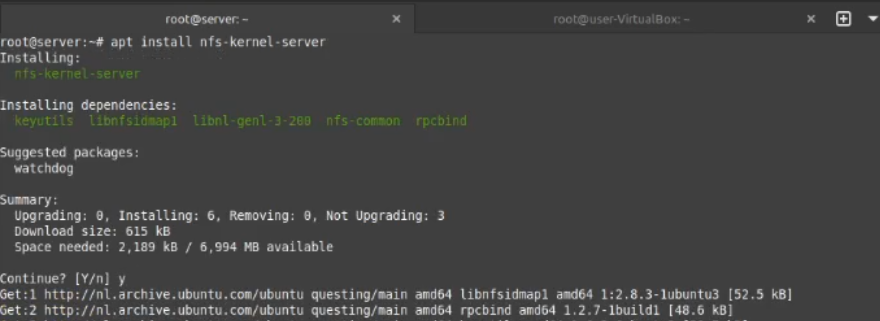
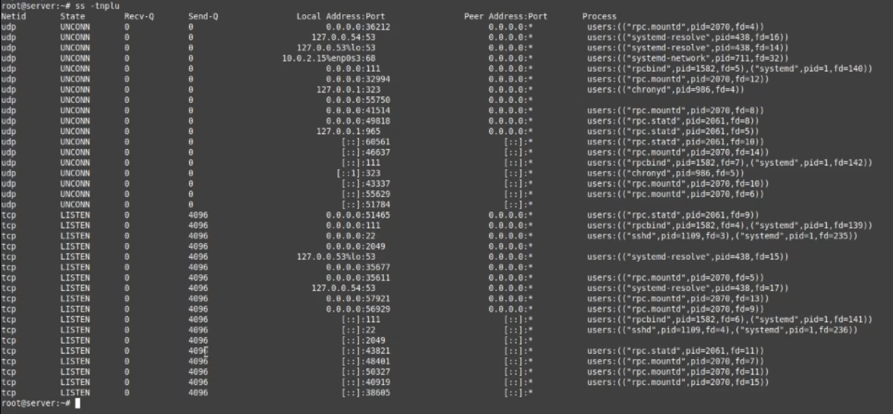
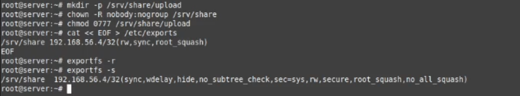
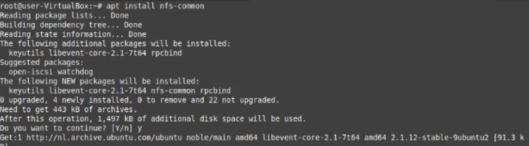
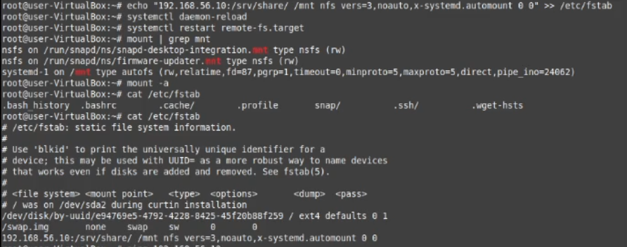
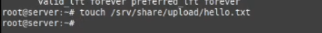
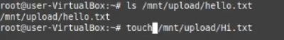
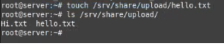
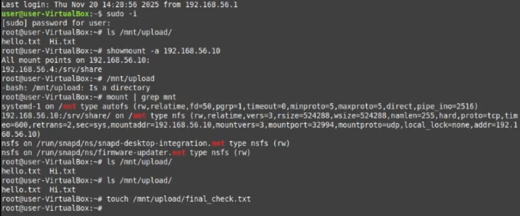
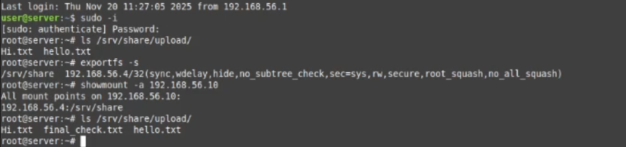

# Работа с NFS - Домашняя работа

Запускаю сервер и клиент, захожу на обоих по ssh в разных вкладках, ставлю nfs server на сервер.

Проверяю всё ли в порядки с портами, вижу что нужные слушаются.

Создаю директорию под шаринг, накидываю права, прописываю настройки для nfs и проверяю.

Захожу на клиент и ставлю клиент nfs.

После установки прописываю монтирование, ребутаю деманов и проверяю fstab.

На сервере создаю файл.

Проверяю появился ли он на клиенте (да). Здесь же создаю ещё файл.

Иду на сервер проверять второй файл (всё на месте).

Перезагружаю машины, на клиенте проверЯю всё ли работает и шариться. Создаю финальный файл.

На сервере так же проверяю вчто всё запущено и вижу наш финальный файл.

